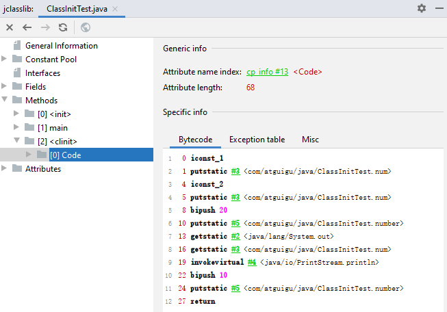

# 第2章 类加载子系统

## 1 内存结构概述

* 简图


* 详细图（英文版）


* 详细图（中文版）


* 类加载器子系统


* 运行时数据区


* 执行引擎等


* 如果自己手写一个Java虚拟机的话，主要考虑哪些结构呢？
  * 类加载器和执行引擎

## 2 类加载器与类的加载过程

* 类加载器子系统作用

  * 类加载器子系统作用负责从文件系统或者网络中加载Class文件，class文件在文件开头会有特定的文件标识。
  * ClassLoader只负责class文件的加载，只与它是否可以运行，则由Execution Engine决定。
  * 加载的类信息存放在一块称为<font color=red>**方法区**</font>的内存空间。除了类的信息外，方法区中还会存放运行时常量池信息，可能还包括**字符串字面量**和**数字常量**（这部分常量信息时Class文件中常量池部分的内存映射）

* 类加载器ClassLoader的角色

  

* 类的加载过程

  

  ```java
  public class HelloLoader {
      public static void main(String[] args) {
          System.out.println("谢谢ClassLoader加载我....");
          System.out.println("你的大恩大德，我下辈子再报！");
      }
  }
  ```

  

  * 加载：

    1. 通过一个类的全限名获取定义此类的二进制字节流

    2. 将这个字节流所代表的静态存储结构转化为方法区的运行时数据结构
    3. <font color=red>**在内存中生成一个代表这个类的java.lang.Class对象**</font>，作为方法区这个类的各种数据的访问入口

    * 补充：加载.class文件放入方式
      * 从本地系统中直接加载
      * 通过网络获取，典型场景：Web Applet
      * 从zip压缩包中读取，成为日后jar、war格式的基础
      * 运行时计算生成，使用最多的是：动态代理技术
      * 由其他文件生成，典型场景：JSP应用
      * 从专有数据库中提取.class文件，比较少见
      * 从加密文件中获取，典型的防Class文件被反编译的保护措施

  * 链接

    

  * 初始化

    

    ---

    ```java
    public class ClassInitTest {
       private static int num = 1;
    
       static{
           num = 2;
           number = 20;
           System.out.println(num);
           //System.out.println(number);//报错：非法的前向引用。
       }
    
       private static int number = 10;  // linking之prepare: number = 0 --> initial: 20 --> 10
    
        public static void main(String[] args) {
            System.out.println(ClassInitTest.num);  // 2
            System.out.println(ClassInitTest.number);  // 10
        }
    }
    ```

    **结果：**

    ​			2

    ​			10

    通过jclasslib可以查看其内部执行过程

    

    ---
    
    JVM会保证父类的\<clinit>()首先执行
    
    ```java
    public class ClinitTest1 {
        static class Father{
            public static int A = 1;
            static{ A = 2; }
        }
    
        static class Son extends Father{
            public static int B = A;
        }
    
        public static void main(String[] args) {
            //加载Father类，其次加载Son类。
            System.out.println(Son.B);//2
        }
    }
    ```
    
    ---
    
    虚拟机必须保证一个类的\<clinit>()方法在多线程下被同步加锁，并且只会被加载一次
    
    ```java
    public class DeadThreadTest {
        public static void main(String[] args) {
            Runnable r = () -> {
                System.out.println(Thread.currentThread().getName() + "开始");
                DeadThread dead = new DeadThread();
                System.out.println(Thread.currentThread().getName() + "结束");
            };
    
            Thread t1 = new Thread(r,"线程1");
            Thread t2 = new Thread(r,"线程2");
    
            t1.start();
            t2.start();
        }
    }
    
    class DeadThread{
        static{
            if(true){
                System.out.println(Thread.currentThread().getName() + "初始化当前类");
                while(true){
    
                }
            }
        }
    }
    ```
    
    **结果：**
    
    ​			线程1开始
    
    ​			线程2开始
    
    ​			线程1初始化当前类
    
    ​			线程2结束
    
    ​			线程1结束

## 3 类加载器分类

* JVM支持两种类型的类加载器，分别是<font color=red>**引导类加载器（Bootstrap ClassLoader）**</font>和<font color=red>**自定义类加载器（User-Defined ClassLoader）**</font>

* 从概念上讲，自定义类加载器是指程序中由开发人员自定义的一类加载器，然而Java虚拟机规范却并没有这么定义，而是<font color=red>**将所有派生与抽象类ClassLoader的类加载器都划分为自定义类加载器**</font>。

* 无论类加载器的类型如何划分，在程序中我们最常见的类加载器始终只有三个，如下图：

  

  Bootstrap ClassLoader是由C++语言实现的，其余的是由Java语言实现的

  

  ---

  ```java
  public class ClassLoaderTest {
      public static void main(String[] args) {
  
          //获取系统类加载器
          ClassLoader systemClassLoader = ClassLoader.getSystemClassLoader();
          System.out.println(systemClassLoader);//sun.misc.Launcher$AppClassLoader@18b4aac2
  
          //获取其上层：扩展类加载器
          ClassLoader extClassLoader = systemClassLoader.getParent();
          System.out.println(extClassLoader);//sun.misc.Launcher$ExtClassLoader@1540e19d
  
          //获取其上层：获取不到引导类加载器
          ClassLoader bootstrapClassLoader = extClassLoader.getParent();
          System.out.println(bootstrapClassLoader);//null
  
          //对于用户自定义类来说：默认使用系统类加载器进行加载
          ClassLoader classLoader = ClassLoaderTest.class.getClassLoader();
          System.out.println(classLoader);//sun.misc.Launcher$AppClassLoader@18b4aac2
  
          //String类使用引导类加载器进行加载的。---> Java的核心类库都是使用引导类加载器进行加载的。
          ClassLoader classLoader1 = String.class.getClassLoader();
          System.out.println(classLoader1);//null
      }
  }
  ```

* 虚拟机自带的加载器

  * 启动类加载器（引导类加载器，Bootstrap ClassLoader）
    * 这个类加载使用<font color=red>**C/C++语言实现的**</font>，嵌套在JVM内部
    * 它用来加载Java核心类库(JAVA_HOME/jre/lib/rt.jar、resources.jar或sun.boot.class.path路径下的内容)，用于提供JVM自身需要的类
    * 并不继承自java.lang.ClassLoader，没有父加载器
    * 加载扩展类和应用程序加载器，并指定为他们的父类加载器
    * 出于安全考虑，Bootstrap启动类加载器只加载包名为java、javax、sun等开头的类
  * 扩展类加载器（Extension ClassLoader）
    * <font color=red>**Java语言编写**</font>，由sun.misc.Launcher$ExtClassLoader实现。
    * <font color=red>**派生于ClassLoader类**</font>
    * 父类加载器为启动类加载器
    * 从java.ext.dirs系统属性所指定的目录加载类库，或从JDK安装目录的jre/lib/ext子目录（扩展目录）下加载类库。<font color=red>**如果用户创建的JAR放在此目录下，也会自动由扩展类加载器加载**</font>。
  * 应用程序类加载器（系统类加载器，AppClassLoader）
    * java语言编写，由sun.misc.Launcher$AppClassLoader实现。
    * <font color=red>**派生于ClassLoader类**</font>
    * 父类加载器为启动类加载器
    * 它负责加载环境变量classpath或系统属性java.class.path指定路径下的类库
    * <font color=red>**该类加载是程序中默认的类加载器**</font>，一般来说，Java应用的类都是由它来完成加载
    * 通过ClassLoader.getSystemClassLoader()方法可以获取到该类加载器

* 加载器加载内容

  ```java
  public class ClassLoaderTest1 {
      public static void main(String[] args) {
          System.out.println("------------启动类加载器------------");
          //获取BootstrapClassLoader能够加载的api的路径
          URL[] urLs = sun.misc.Launcher.getBootstrapClassPath().getURLs();
          for (URL element : urLs) {
              System.out.println(element.toExternalForm());
          }
          //从上面的路径中随意选择一个类,来看看他的类加载器是什么:引导类加载器
          ClassLoader classLoader = Provider.class.getClassLoader();
          System.out.println(classLoader);
  
          System.out.println("------------扩展类加载器------------");
          String extDirs = System.getProperty("java.ext.dirs");
          for (String path : extDirs.split(";")) {
              System.out.println(path);
          }
          //从上面的路径中随意选择一个类,来看看他的类加载器是什么:扩展类加载器
          ClassLoader classLoader1 = CurveDB.class.getClassLoader();
          System.out.println(classLoader1);//sun.misc.Launcher$ExtClassLoader@1540e19d
      }
  }
  ```

  **结果：**

  ​			------------启动类加载器------------

  ​			file:/D:/Java/jdk1.8.0_231/jre/lib/resources.jar

  ​			file:/D:/Java/jdk1.8.0_231/jre/lib/rt.jar

  ​			file:/D:/Java/jdk1.8.0_231/jre/lib/sunrsasign.jar

  ​			file:/D:/Java/jdk1.8.0_231/jre/lib/jsse.jar

  ​			file:/D:/Java/jdk1.8.0_231/jre/lib/jce.jar

  ​			file:/D:/Java/jdk1.8.0_231/jre/lib/charsets.jar

  ​			file:/D:/Java/jdk1.8.0_231/jre/lib/jfr.jar

  ​			file:/D:/Java/jdk1.8.0_231/jre/classes

  ​			null

  ​			------------扩展类加载器------------

  ​			D:\Java\jdk1.8.0_231\jre\lib\ext

  ​			C:\WINDOWS\Sun\Java\lib\ext

  ​			sun.misc.Launcher$ExtClassLoader@12a3a380

* 用户自定义类加载器

  * 在Java日常应用程序开发中，类的加载几乎是由上述3种加载器相互配合执行的，在必要时，我们还可以自定义类加载器，来定制类的加载方式。
  * 为什么需要自定义类加载器？
    * 隔离加载类
    * 修改类加载的方式
    * 扩展加载源
    * 防止源码泄露
  * 用户自定义类加载器实现步骤：
    * 开发人员可以通过集成抽象类java.lang.ClassLoader类的方式，实现自己的类加载器，以满足一些特殊的需求
    * 在JDK1.2之前，在自定义类加载器时，总会去集成ClassLoader类并重写loadClass()方法，从而实现自定义的类加载器，但是在JDK1.2之后已不再建议用户去覆盖loadClass()方法，而是建议把自定义的类加载逻辑卸载findClass()方法中
    * 在编写自定义的类加载器时，如果没有过于复杂的需求，可以直接继承URLClassLoader类，这样就可以避免自己去编写findClass()方法及获取字节码流的方式，使自定义类加载器编写更加简洁。

  ```java
  public class CustomClassLoader extends ClassLoader {
      @Override
      protected Class<?> findClass(String name) throws ClassNotFoundException {
  
          try {
              byte[] result = getClassFromCustomPath(name);
              if(result == null){
                  throw new FileNotFoundException();
              }else{
                  return defineClass(name,result,0,result.length);
              }
          } catch (FileNotFoundException e) {
              e.printStackTrace();
          }
  
          throw new ClassNotFoundException(name);
      }
  
      private byte[] getClassFromCustomPath(String name){
          //从自定义路径中加载指定类:细节略
          //如果指定路径的字节码文件进行了加密，则需要在此方法中进行解密操作。
          return null;
      }
  
      public static void main(String[] args) {
          CustomClassLoader customClassLoader = new CustomClassLoader();
          try {
              Class<?> clazz = Class.forName("One",true,customClassLoader);
              Object obj = clazz.newInstance();
              System.out.println(obj.getClass().getClassLoader());
          } catch (Exception e) {
              e.printStackTrace();
          }
      }
  }
  ```

## 4 ClassLoader的使用说明

* ClassLoader类，它是一个抽象类，其后所有的类加载器都继承自ClassLoader（不包括启动类加载器）

  

  

* 获取ClassLoader的途径

  * 方式一：获取当前类的ClassLoader：class.getClassLoader()
  * 方式二：获取当前线程上下文的ClassLoader：Thread.current().getContextLoader()
  * 方式三：获取系统的ClassLoader：ClassLoader.getSystemClassLoader()
  * 方式四：获取调用者的ClassLoader：DriverManager.getCallerClassLoader()

  ```java
  public class ClassLoaderTest2 {
      public static void main(String[] args) {
          try {
              //1.
              ClassLoader classLoader = Class.forName("java.lang.String").getClassLoader();
              System.out.println(classLoader);
              //2.
              ClassLoader classLoader1 = Thread.currentThread().getContextClassLoader();
              System.out.println(classLoader1);
              //3.
              ClassLoader classLoader2 = ClassLoader.getSystemClassLoader().getParent();
              System.out.println(classLoader2);
  
          } catch (ClassNotFoundException e) {
              e.printStackTrace();
          }
      }
  }
  ```

  **结果：**

  ​			null

  ​			sun.misc.Launcher$AppClassLoader@18b4aac2

  ​			sun.misc.Launcher$ExtClassLoader@1b6d3586

## 5 双亲委派机制

* Java虚拟机对class文件采用的是<font color=red>**按需加载**</font>的方式，也就是说当需要使用该类时才会将他的class文件加载到内存生成Class对象。而且加载某个类的class文件是=时，Java虚拟机采用的是<font color=red>**双亲委派机制**</font>，即把请求交由父类处理，它是一种任务委派模式。

* 一个问题？在当前模块下，创建一个java.lang.String类，并使用，会使用我们创建的String吗？

  

  ```java
  public class String {
      //
      static{
          System.out.println("我是自定义的String类的静态代码块");
      }
  //    //错误: 在类 java.lang.String 中找不到 main 方法
  //    public static void main(String[] args) {
  //        System.out.println("hello,String");
  //    }
  }
  ```

  ```java
  public class StringTest {
      public static void main(String[] args) {
          java.lang.String str = new java.lang.String();
          System.out.println("hello,atguigu.com");
  
          StringTest test = new StringTest();
          System.out.println(test.getClass().getClassLoader());
      }
  }
  ```

  **结果：**

  ​			hello,atguigu.com

  ​			sun.misc.Launcher$AppClassLoader@18b4aac2

  从运行的结果看，是不会运行我们自定义的String的，原因就是因为双亲委派机制。

* 双亲委派机制

  

  

  * 优势

    * 避免类的重复加载

    * 保护程序安全，防止核心API被随意篡改

      * 自定义类：java.lang.String

      * 自定义类：java.lang.ShkStart

        ```java
        package java.lang;
        
        public class ShkStart {
            public static void main(String[] args) {
                System.out.println("hello!");
            }
        }
        ```

        **结果：**

        

  * 沙箱安全机制

    * 自定义String类，但是在加载自定义String类的时候回率先使用引导类加载器加载，而引导类加载器在加载的过程中会先加载jdk自带的文件（rt.jar包中java\lang\lang\String.class），报错信息说没有main方法，就是因为加载的是rt.jar包中的String类。这样可以保证对java核心源代码的保护，这就是<font color=red>**沙箱安全机制**</font>。

## 6 其他

* 在JVM中表示两个class对象是否为同一个类存在两个必要条件：

  * 类的完整名必须相同，包括包名。
  * 加载这个类的ClassLoader（指ClassLoader实例对象）必须相同。

* 换句话说，在JVM中，即使两个类对象（class对象）来源于同一个class文件，被同一个虚拟机所加载，但只要加载他们的ClassLoader实例对象不同，那么这两个类对象也是不同的。

* 对加载器的引用

  * JVM必须知道一个类型是由启动类加载器加载还是用户类加载器加载的。如果一个类型是由用户类加载器加载的，那么JVM会<font color=red>**将这个类加载器的一个引用作为类型信息的一部分保存在方法区中**</font>。当解析一个类型到另一个类型的引用的时候，JVN需要保证这两个类型的类加载器时相同的。

* 类的主动使用和被动使用

  