#  第13章 StringTable

## 1 String的基本特性

* String：字符串，使用一对""引起来表示。

  * String s1 = "Hello";  // 字面量定义方式
  * String s2 = new String("Hello");

* String声明为final的，不可被继承

* String实现了Serializable接口：表示字符串是支持序列化的。

  ​		   实现了Comparable接口：表示String可以比较大小

* String在JDK8及以前内部定义了final char[] value用于储存字符串数据。JDK9时改为byte[]

---

* String在jdk9中存储结构变更

  * http://openjdk.java.net/jeps/254

    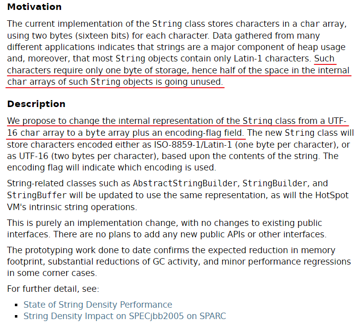

  * 结论：String再也不用char[]来存储了，改成了byte[]加上编码标识，节约了一些空间。

    ```java
    public final class String
        implements java.io.Serializable, Comparable<String>, CharSequence {
        // ...
        @Stable
        private final byte[] value;
        
        // ...
    }
    ```

  * 那StringBuffer和StringBuilder是否仍无动于衷呢？

    * 字符串相关的类如 AbstractStringBuilder、StringBuilder 和 StringBuffer 将更新为使用相同的表示，HotSpot VM 的内在（固有的、内置的）字符串操作也将更新。
    * String-related classes such as `AbstractStringBuilder`, `StringBuilder`, and `StringBuffer` will be updated to <font color=red>**use the same representation**</font>, as will the HotSpot VM's intrinsic（固有的、内置的） string operations.

---

* String：代表不可变的字符序列。简称：不可变性。

  * 当对字符串重新赋值时，需要重写指定内存区域赋值，不能使用原有的value进行赋值。
  * 当对现有的字符串进行连接操作时，也需要重新指定内存区域赋值，不能使用原有的value进行赋值。
  * 当调用String的replace()方法修改指定字符或字符串时，需要重新】指定内存区域赋值，不能使用原有的value赋值。

* 通过字面量的方式（区别于new）给一个字符串赋值，此时的字符串值生命在常量池中。

* 代码演示

  ```java
  /**
   * String的基本使用:体现String的不可变性
   */
  public class StringTest1 {
      @Test
      public void test1() {
          String s1 = "abc";  // 字面量定义的方式，"abc"存储在字符串常量池中
          String s2 = "abc";
          s1 = "hello";
  
          System.out.println(s1 == s2);  // 判断地址：true  --> false
          System.out.println(s1);  // hello
          System.out.println(s2);  // abc
      }
  
      @Test
      public void test2() {
          String s1 = "abc";
          String s2 = "abc";
          s2 += "def";
          System.out.println(s1 == s2);
          System.out.println(s2);  // abcdef
          System.out.println(s1);  // abc
      }
  
      @Test
      public void test3() {
          String s1 = "abc";
          String s2 = s1.replace('a', 'm');
          System.out.println(s1 == s2);
          System.out.println(s1);  // abc
          System.out.println(s2);  // mbc
      }
  }
  ```

---

* 一道面试题

  ```java
  public class StringExer {
      String str = new String("good");
      char[] ch = {'t', 'e', 's', 't'};
  
      public void change(String str, char ch[]) {
          // this.str = "test ok"; // this直接改变str的字面量，开辟新的字符串
          str = "test ok"; // 这里的str只是形参，不会改变成员变量的值
          ch[0] = 'b';
      }
  
      public static void main(String[] args) {
          StringExer ex = new StringExer();
          ex.change(ex.str, ex.ch);
          System.out.println(ex.str);  // good
          System.out.println(ex.ch);   // best
      }
  }
  
  ```

---

* <font color=red>**字符串常量池中是不会存储相同的内容的字符串的**</font>。

  * String是String Pool（字符串常量池）是一个固定大小的**Hashtable**，默认值大小长度时1009.如果放进String Pool的String非常多，就会造成Hash冲突严重，从而导致链表会很长，而链表长了以后直接会造成的影响就是当调用String.intern时性能大幅下降。

  * 使用<font color=blue>**-XX:StringTableSize**</font>可以设置StringTable的长度

  * 在jdk6中StringTable是固定的，就是**1009**的长度，所以常量池中的字符串过多就会导致效率下降很快。StringTableSize设置没有要求

  * 在jdk7中，StringTable的默认长度时**60013**，StringTableSize设置没有要求

  * **jdk8**开始，设置StringTable的长度的话，1009是可以设置的最小值。

    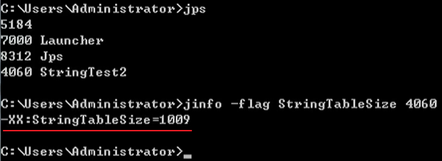

    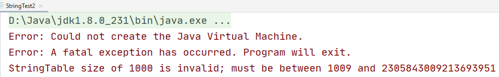

  * 设置不同的StringTableSize的性能对比

    ```java
    public class StringTest2 {
        public static void main(String[] args) {
            // 测试StringTableSize参数
            // System.out.println("我来打个酱油");
            // try {
            //     Thread.sleep(1000000);
            // } catch (InterruptedException e) {
            //     e.printStackTrace();
            // }
    
            BufferedReader br = null;
            try {
                // word.txt是含有10万行，每行长度1~10的txt文件
                br = new BufferedReader(new FileReader("words.txt"));
                long start = System.currentTimeMillis();
                String data;
                while ((data = br.readLine()) != null) {
                    data.intern();   // 如果字符串常量池中没有对应data的字符串的话，则在常量池中生成
                }
                long end = System.currentTimeMillis();
                System.out.println("花费的时间为：" + (end - start));  // 1009:136ms  100009:49ms
            } catch (IOException e) {
                e.printStackTrace();
            } finally {
                if (br != null) {
                    try {
                        br.close();
                    } catch (IOException e) {
                        e.printStackTrace();
                    }
                }
            }
        }
    }
    
    ```

## 2 String的内存分配

* 在Java语言中有8种基本数据类型和一种比较特殊的类型String。这些类型为了使他们再运行过程中更快、更节省内存，都提供了一种常量池的概念。
* 常量池就类似于一个Java系统级别提供的缓存。8中基本数据类型的常量池都是系统协调的，<font color=red>**String类型的常量池比较特殊。它的主要使用方法有两种**</font>。
  * 直接使用双引号声明出来的String对象会直接存储在字符串常量池中。
    * 比如： String info = "Hello";
  * 如果不是用双引号声明的String对象，可以使用String提供的intern()方法。这个后面重点谈。
* 直接new String()生成的对象会保存在**堆**中，注：不是在堆中的字符串常量池中（jdk8）

---

* Java 6及以前，字符创常量池存放在永久代。

  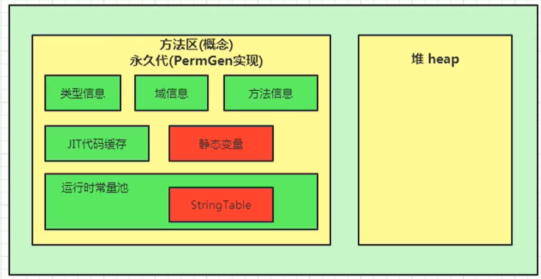

* Java 7中Oracle的工程师对字符串常量池的逻辑做了很大的改变，即将<font color=red>**字符串常量池的位置调整到Java堆中**</font>。

  * 所有的字符串都保存在堆（Heap）中，和其他普通对象一样，这样可以让你在进行调优应用时仅需要调整堆大小就可以了。

  * 字符串常量池概念原本使用的比较多，但是这个改动使得我们有足够的理由让我们重新考虑在Java 7中使用String.intern()。

    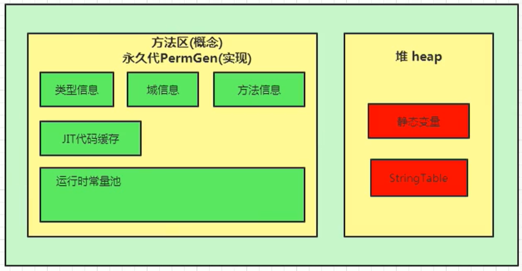

* Java 8元空间，字符串常量在堆上。

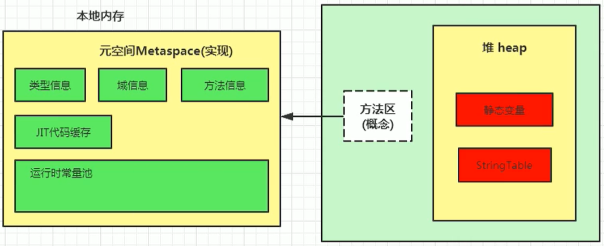

---

* StringTable为什么要调整？

  ① permSize默认比较小

  ② 方法区垃圾回收频率比较低

  * 官网：https://www.oracle.com/technetwork/java/javase/jdk7-relnotes-418459.html#jdk7changes

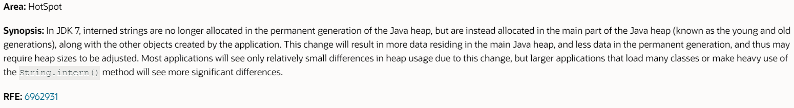

* 代码演示OOM：

  ```java
  /**
   * jdk6中：
   * -XX:PermSize=6m -XX:MaxPermSize=6m -Xms6m -Xmx6m
   * <p>
   * jdk8中：
   * -XX:MetaspaceSize=10m -XX:MaxMetaspaceSize=10m -Xms10m -Xmx10m
   * @Description: 验证jdk6之前StringTable在永久代，jdk7挪到堆内
   */
  public class StringTest3 {
      public static void main(String[] args) {
          // 使用Set保存着常量池引用，避免full gc回收常量池行为
          Set<String> set = new HashSet<String>();
          // 在short可以取值的范围内足以让6MB的PermSize或heap产生OOM了。
          int i = 0;
          while (true) {
              set.add(String.valueOf(i++).intern());
          }
      }
  }
  
  ```

  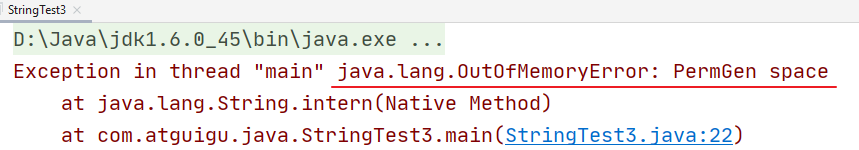
  
  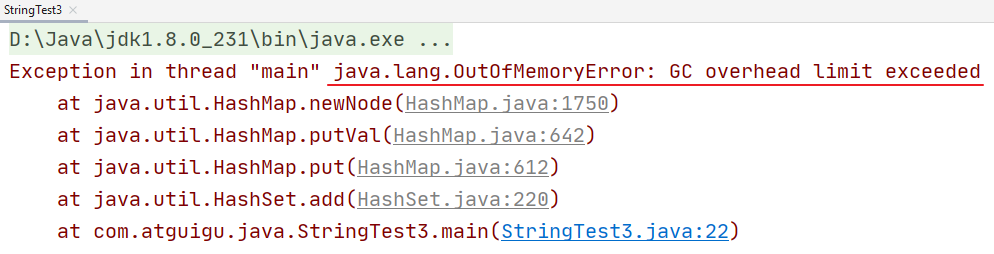

## 3 String的基本操作

```java
public class StringTest4 {
    public static void main(String[] args) {
        System.out.println();  // 常量池中字符串个数：2166
        System.out.println("1");  // 2167
        System.out.println("2");
        System.out.println("3");
        System.out.println("4");  // 2170
        //如下的字符串"1" 到 "4"不会再次加载
        System.out.println("1");  // 2171
        System.out.println("2");  // 2171
        System.out.println("3");
        System.out.println("4");  // 2171
    }
}
```

Java语言规范里要求完全相同的字符串字面量，应该包含同样的Unicode字符序列（包含同一份码点序列的常量），并且必须是指向同一个String类实例。

---

```java
class Memory {
    public static void main(String[] args) {  // line 1
        int i = 1;  // line 2
        Object obj = new Object();  // line 3
        Memory mem = new Memory();  // line 4
        mem.foo(obj);  // line 5
    }  // line 9

    private void foo(Object param) {  // line 6
        String str = param.toString();  // line 7
        System.out.println(str);
    }  // line 8
}
```

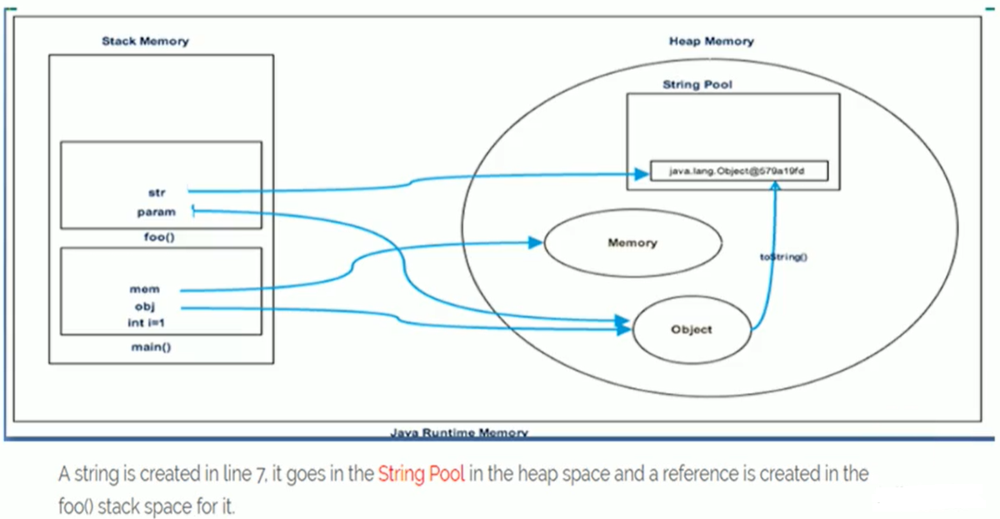

## 4 字符串拼接操作

* 字符串拼接操作
  1. 常量与常量的拼接结果在常量池，原理是编译器优化
  2. 常量池中不会存在相同内容的变量。
  3. 只要其中一个是**变量**，结果就在堆（堆中的非字符串常量池的位置）中。变量拼接的原理是StringBuilder。
  4. 如果拼接的结果调用intern()方法，则主动将常量池中还没有的字符串对象放入字符串常量池中，并返回此对象地址。

---

```java
/**
 * @Description: 字符串拼接操作
 * @Author: Hypocrite30
 * @Date: 2021/6/17 18:28
 */
public class StringTest5 {
    @Test
    public void test1() {
        String s1 = "a" + "b" + "c";  // 编译（前端编译）期优化：等同于"abc"
        String s2 = "abc";  // "abc"一定是放在字符串常量池中，将此地址赋给s2
        /*
         * 最终.java编译成.class,再执行.class
         * String s1 = "abc";
         * String s2 = "abc"
         */
        System.out.println(s1 == s2);  // true
        System.out.println(s1.equals(s2));  // true
    }

    @Test
    public void test2() {
        String s1 = "javaEE";
        String s2 = "hadoop";

        String s3 = "javaEEhadoop";
        String s4 = "javaEE" + "hadoop";  // 编译期优化
        // 如果拼接符号的前后出现了变量，则相当于在堆空间中new String()，具体的内容为拼接的结果：javaEEhadoop
        String s5 = s1 + "hadoop";
        String s6 = "javaEE" + s2;
        String s7 = s1 + s2;

        System.out.println(s3 == s4);  // true
        System.out.println(s3 == s5);  // false
        System.out.println(s3 == s6);  // false
        System.out.println(s3 == s7);  // false
        System.out.println(s5 == s6);  // false
        System.out.println(s5 == s7);  // false
        System.out.println(s6 == s7);  // false
        // intern():判断字符串常量池中是否存在javaEEhadoop值，如果存在，则返回常量池中javaEEhadoop的地址；
        // 如果字符串常量池中不存在javaEEhadoop，则在常量池中加载一份javaEEhadoop，并返回次对象的地址。
        String s8 = s6.intern();
        System.out.println(s3 == s8);  // true
    }

    @Test
    public void test3() {
        String s1 = "a";
        String s2 = "b";
        String s3 = "ab";
        /*
        如下的s1 + s2 的执行细节：(变量s是我临时定义的）
        ① StringBuilder s = new StringBuilder();
        ② s.append("a")
        ③ s.append("b")
        ④ s.toString()  --> 约等于 new String("ab")

        补充：在jdk5.0及之后使用的是StringBuilder,在jdk5.0之前使用的是StringBuffer
         */
        String s4 = s1 + s2;
        System.out.println(s3 == s4);  // false
    }

    /*
    1. 字符串拼接操作不一定使用的是StringBuilder!
       如果拼接符号左右两边都是字符串常量或常量引用，则仍然使用编译期优化，即非StringBuilder的方式。
    2. 针对于final修饰类、方法、基本数据类型、引用数据类型的量的结构时，能使用上final的时候建议使用上。
     */
    @Test
    public void test4() {
        final String s1 = "a";
        final String s2 = "b";
        String s3 = "ab";
        String s4 = s1 + s2;
        System.out.println(s3 == s4);  // true
    }

    //练习：
    @Test
    public void test5() {
        String s1 = "javaEEhadoop";
        String s2 = "javaEE";
        String s3 = s2 + "hadoop";
        System.out.println(s1 == s3);  // false

        final String s4 = "javaEE";  // s4:常量
        String s5 = s4 + "hadoop";
        System.out.println(s1 == s5);  // true

    }

    /*
    体会执行效率：通过StringBuilder的append()的方式添加字符串的效率要远高于使用String的字符串拼接方式！
    详情：① StringBuilder的append()的方式：自始至终中只创建过一个StringBuilder的对象
          使用String的字符串拼接方式：创建过多个StringBuilder和String的对象
         ② 使用String的字符串拼接方式：内存中由于创建了较多的StringBuilder和String的对象，内存占用更大；如果进行GC，需要花费额外的时间。

     改进的空间：在实际开发中，如果基本确定要前前后后添加的字符串长度不高于某个限定值highLevel的情况下,建议使用构造器实例化：
               StringBuilder s = new StringBuilder(highLevel);  // new char[highLevel]
     */
    @Test
    public void test6() {

        long start = System.currentTimeMillis();

//        method1(100000);  // 4014
        method2(100000);  // 7

        long end = System.currentTimeMillis();

        System.out.println("花费的时间为：" + (end - start));
    }

    public void method1(int highLevel) {
        String src = "";
        for (int i = 0; i < highLevel; i++) {
            src = src + "a";  // 每次循环都会创建一个StringBuilder、String
        }
//        System.out.println(src);

    }

    public void method2(int highLevel) {
        // 只需要创建一个StringBuilder
        StringBuilder src = new StringBuilder();
        for (int i = 0; i < highLevel; i++) {
            src.append("a");
        }
//        System.out.println(src);
    }
}
```

* 对于test1，两种方式可以证明s1编译前已经被优化为"abc"

  * 通过查看编译后的字节码文件内容

    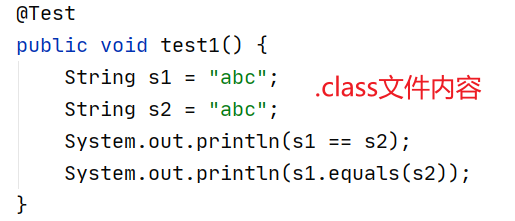

  * 通过jclasslib查看字节码信息

    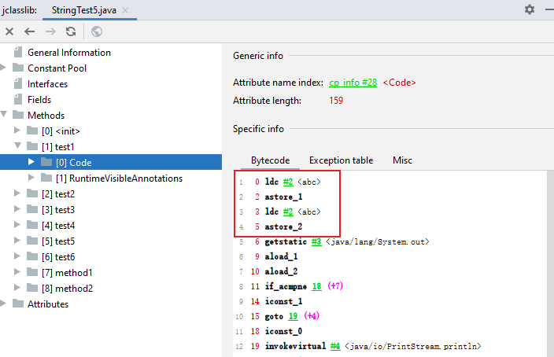

* 对于test3()，我们可以通过jclasslib看到s4是如何被创建的

  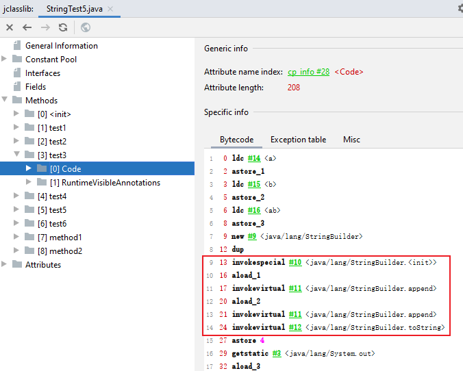

* 对于test4()，里面的量用final修饰，仍然使用编译期优化，相当于s4 = "a" + "b";

## 5 intern()使用

* intern()源码

  ```java
  public final class String
      implements java.io.Serializable, Comparable<String>, CharSequence {
  	// ...
      
      public native String intern();
  }
  ```

  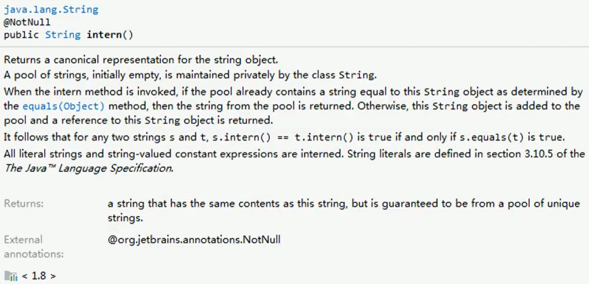

---

* 如果不是双引号声明的String对象，可以使用String提供的intern方法：intern方法会从字符串常量池中查询当前字符串是否存在，若不存在就将当前字符串放入常量池中。
  * 比如：String myInfo = new String("Hello").intern();
* 也就是说，如果在任意字符串上调用String.intern方法，那么返回结果所指向的那个类实例，必须和直接以常量形式的字符串实例完全相同。因此，下列表达式的值必定为true：
  * ("a" + "b" + "c").intern() == "abc"
* 通俗点将，Interned String就是确保字符串在内存里只有一份拷贝，这样可以节约内存，加快字符串操作任务的执行速度。注意，这个值会被存放在字符串内部池（String Intern Pool）。

---

* 关于new String创建对象的个数问题：根本是从字节码分析

  ```java
  /**
   * 题目：
   * new String("ab")会创建几个对象？看字节码，就知道是两个。
   * 一个对象是：new关键字在堆空间创建的
   * 另一个对象是：字符串常量池中的对象"ab"。 证明：字节码指令：ldc
   * <p>
   * <p>
   * 思考：
   * new String("a") + new String("b")呢？
   * 对象1：new StringBuilder()
   * 对象2： new String("a")
   * 对象3： 常量池中的"a"
   * 对象4： new String("b")
   * 对象5： 常量池中的"b"
   * <p>
   * 深入剖析： StringBuilder的toString():
   * 对象6 ：new String("ab")
   * 强调一下，toString()的调用，在字符串常量池中，没有生成"ab"
   * @Description: 剖析 new String()
   * @Author: Hypocrite30
   * @Date: 2021/6/18 14:07
   */
  public class StringNewTest {
      public static void main(String[] args) {
          // String str = new String("ab");
  
          String str = new String("a") + new String("b");
      }
  }
  
  ```
  
* `new String("ab")` 字节码

  * 0 - 3: new String()
  * 4: 从StringTable取出 "ab"

>  0 new #2 <java/lang/String>
>  3 dup
>  4 ldc #3 <ab>
>  6 invokespecial #4 <java/lang/String.<init>>
>  9 astore_1
> 10 return

- `String str = new String("a") + new String("b");` 字节码
  - 0 - 3: 由于是含有变量的拼接，所以需要创建`StringBuilder`来使用
  - 7 - 10: new String()
  - 11: 从StringTable取出"a"
  - 19- 22: new String()
  - 23： 从StringTable取出"b"

>  0 new #2 <java/lang/StringBuilder>
>  3 dup
>  4 invokespecial #3 <java/lang/StringBuilder.<init>>
>  7 new #4 <java/lang/String>
> 10 dup
> 11 ldc #5 <a>
> 13 invokespecial #6 <java/lang/String.<init>>
> 16 invokevirtual #7 <java/lang/StringBuilder.append>
> 19 new #4 <java/lang/String>
> 22 dup
> 23 ldc #8 <b>
> 25 invokespecial #6 <java/lang/String.<init>>
> 28 invokevirtual #7 <java/lang/StringBuilder.append>
> 31 invokevirtual #9 <java/lang/StringBuilder.toString>
> 34 astore_1
> 35 return

- StringBuilder - toString() 字节码
  - 0 - 3: new String() 又创建一对象

>  0 new #80 <java/lang/String>
>  3 dup
>  4 aload_0
>  5 getfield #234 <java/lang/StringBuilder.value>
>  8 iconst_0
>  9 aload_0
> 10 getfield #233 <java/lang/StringBuilder.count>
> 13 invokespecial #291 <java/lang/String.<init>>
> 16 areturn

📌：整个过程没有在字符串常量池中创建**"ab"**

---

- 一道难度极高的面试题：

```java
/**
 * 如何保证变量s指向的是字符串常量池中的数据呢？
 * 有两种方式：
 * 方式一： String s = "shkstart";  // 字面量定义的方式
 * 方式二： 调用intern()
 * String s = new String("shkstart").intern();
 * String s = new StringBuilder("shkstart").toString().intern();
 * @Description:
 * @Author: Hypocrite30
 * @Date: 2021/6/18 21:06
 */
public class StringIntern {
    public static void main(String[] args) {
        String s = new String("1");
        s.intern();  // 调用此方法之前，字符串常量池中已经存在了"1"
        String s2 = "1";
        System.out.println(s == s2);  // jdk6：false   jdk7/8：false

        String s3 = new String("1") + new String("1");  // s3变量记录的地址为：new String("11")
        // 执行完上一行代码以后，字符串常量池中，是否存在"11"呢？答案：不存在！！
        s3.intern();  // 在字符串常量池中生成"11"。如何理解：jdk6:创建了一个新的对象"11",也就有新的地址。
        //         jdk7:此时常量中并没有创建"11",而是创建一个指向堆空间中new String("11")的地址
        String s4 = "11";  // s4变量记录的地址：使用的是上一行代码代码执行时，在常量池中生成的"11"的地址
        System.out.println(s3 == s4); // jdk6：false  jdk7/8：true
    }
}
```

- 第一个样例：
  - s 先在堆上开辟空间，并在StringTable上创建"1"
  - s.intern()时，"1"已在StringTable，并且返回值没有重新给变量 s「**s = s.intern()**」
  - s2 指向StringTable 中的"1"
  - 整个过程，变量s指向的就是堆内的String对象。
- 第二个样例：
  - 第一步StringTable没有创建"11"，理由在上一个例子已说明
  - intern()在jkd6和jdk7操作不同。jdk6把"11"创到永久代中，s3指向堆中String对象，引用当然不同
  - jdk7把"11"创到堆的StringTable中，但堆中存在一个new String("11")，所以空间最大化，StringTable的"11"实际上指向new String("11")，所以s4最后还是指向s3同一个地址。

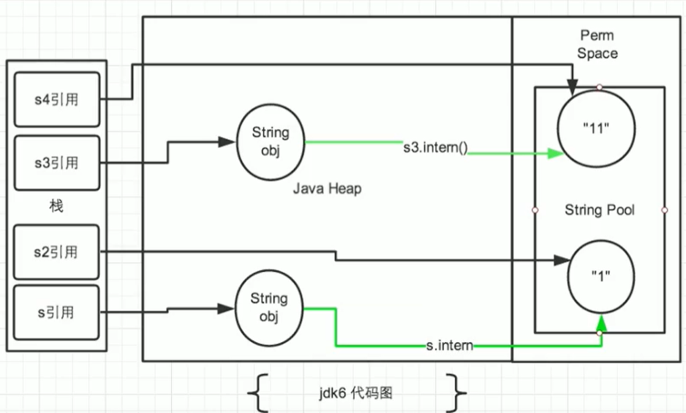

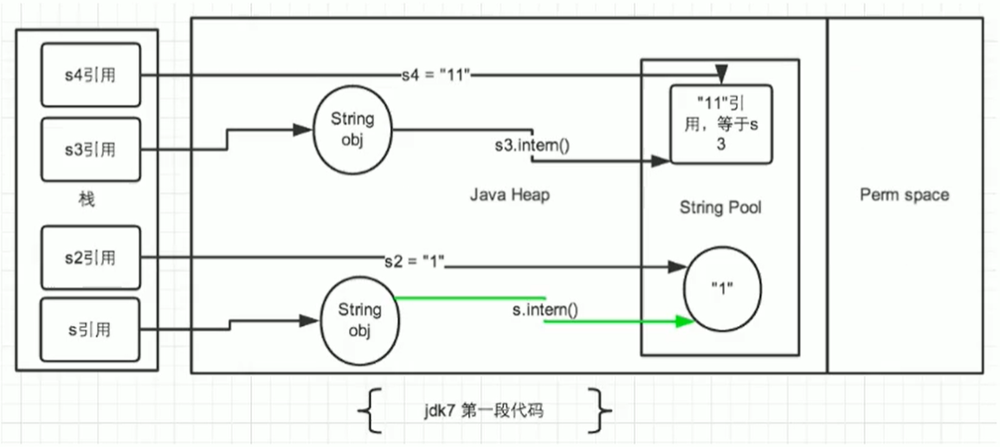

* 上一题的变式

  ```java
  public class StringIntern1 {
      public static void main(String[] args) {
          // StringIntern.java中练习的拓展：
          String s3 = new String("1") + new String("1");  // new String("11")
          // 执行完上一行代码以后，字符串常量池中，是否存在"11"呢？答案：不存在！！
          String s4 = "11";  // 在字符串常量池中生成对象"11"
          String s5 = s3.intern();
          System.out.println(s3 == s4);  // false
          System.out.println(s5 == s4);  // true
      }
  }
  ```

* 总结String的intern()的使用：

  * jdk1.6中，将这个字符串尝试放入串池。
    * 如果串池中有，则并不会放入。返回已有的串池的对象的地址
    * 如果没有，会把<font color=blue>**此对象复制一份**</font>，放入串池，并返回串池中的对象地址
  * jdk1.7起，将这个字符串尝试放入串池
    * 如果串池中有，则并不会放入。返回已有的串池的对象的地址
    * 如果没有，则会把<font color=blue>**对象的引用地址复制一份**</font>，放入串池，并返回串池中的引用地址

---

* intern()的使用：练习1

  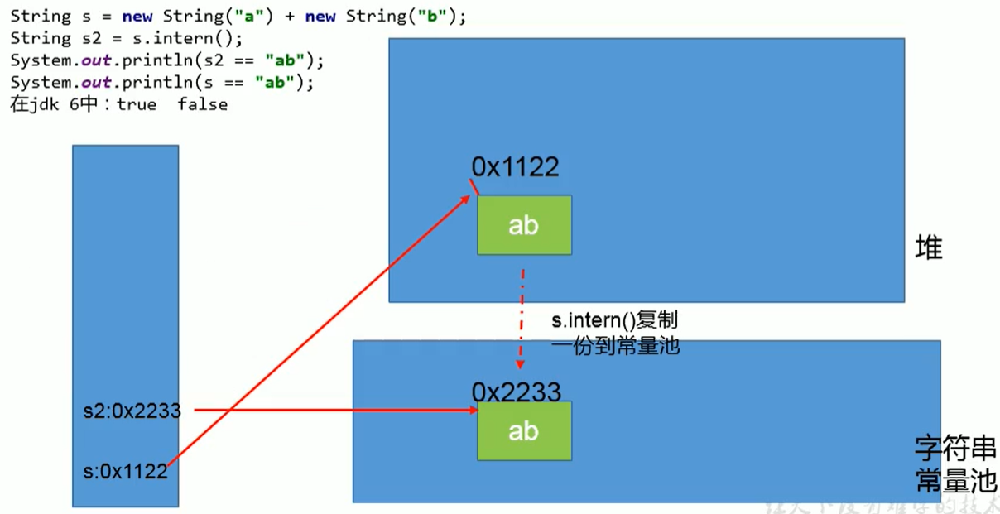

  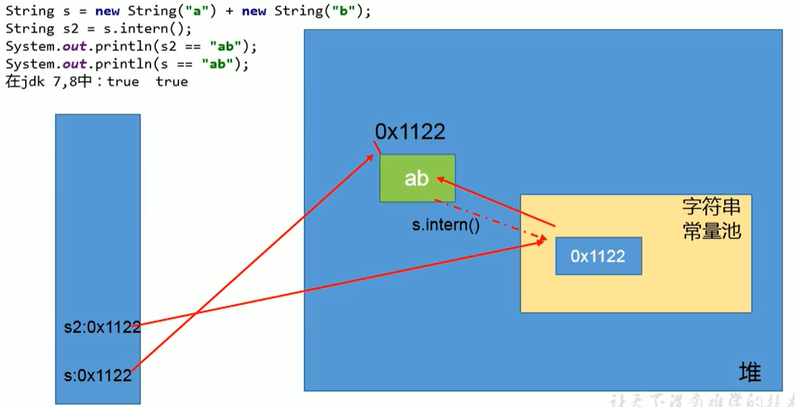

  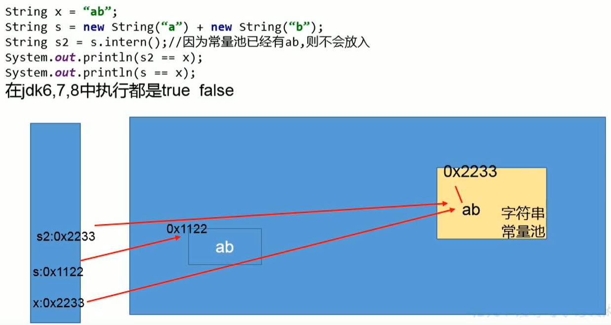

* intern()的使用：练习2

  ```java
  public class StringExer2 {
      public static void main(String[] args) {
          String s1 = new String("ab");  // 执行完以后，会在字符串常量池中会生成"ab"
          s1.intern();
          String s2 = "ab";
          System.out.println(s1 == s2);  // jdk6/7/8：false
      }
  }
  ```

  ```java
  public class StringExer2 {
      public static void main(String[] args) {
          String s1 = new String("a") + new String("b");  // 执行完以后，不会在字符串常量池中会生成"ab"
          s1.intern();
          String s2 = "ab";
          System.out.println(s1 == s2);  // jdk6：false	jdk7/8：true
      }
  }
  ```


---

* intern()空间效率测试

  ```java
  /**
   * 使用intern()测试执行效率：空间使用上
   * <p>
   * 结论：对于程序中大量存在存在的字符串，尤其其中存在很多重复字符串时，使用intern()可以节省内存空间。
   * @Author: Hypocrite30
   * @Date: 2021/6/19 11:14
   */
  public class StringIntern2 {
      static final int MAX_COUNT = 1000 * 10000;
      static final String[] arr = new String[MAX_COUNT];
  
      public static void main(String[] args) {
          Integer[] data = new Integer[]{1, 2, 3, 4, 5, 6, 7, 8, 9, 10};
  
          long start = System.currentTimeMillis();
          for (int i = 0; i < MAX_COUNT; i++) {
              // arr[i] = new String(String.valueOf(data[i % data.length]));
              arr[i] = new String(String.valueOf(data[i % data.length])).intern();
          }
          long end = System.currentTimeMillis();
          System.out.println("花费的时间为：" + (end - start));
  
          try {
              Thread.sleep(1000000);
          } catch (InterruptedException e) {
              e.printStackTrace();
          }
          System.gc();
      }
  }
  ```
  
  **未使用intern()结果：**
  
  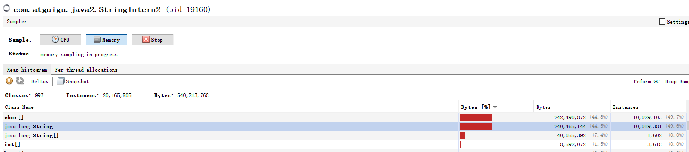
  
  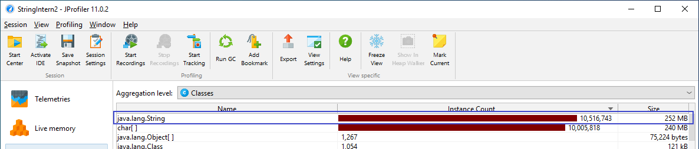
  
  **使用intern()结果：**
  
  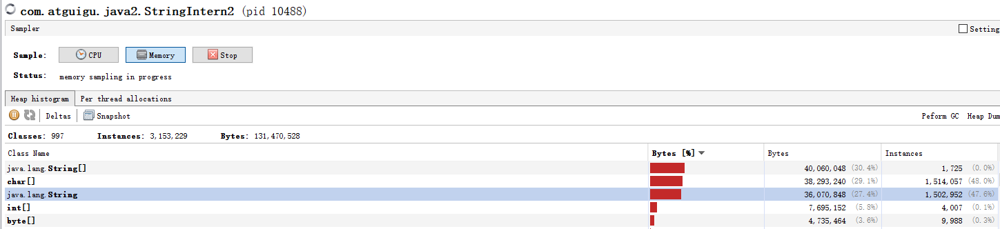
  
  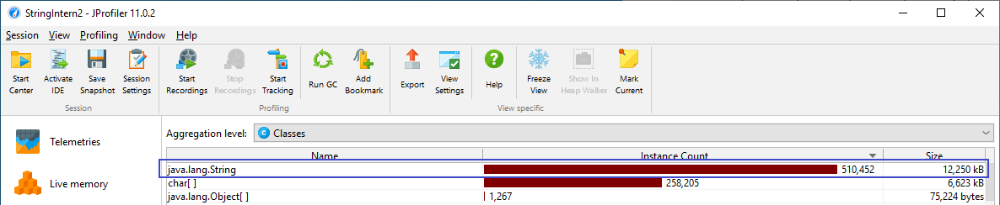
  
  使用intern()会在堆中new对象，同时会在字符串常量池中放入字符串，然后arr[i]指向常量池中的字符串，new出的对象因为无人指向，因此垃圾回收时会被回收，从而达到节省内存的目的。
  
* 大的网站平台，需要内存中存储大量的字符串。比如社交网站，很多人都存储：北京市、海淀区等信息。这时候如果字符串都调用intern()方法，就会明显降低内存的大小。

## 6 StringTable的垃圾回收

```java
/**
 * String的垃圾回收:
 * -Xms15m -Xmx15m -XX:+PrintStringTableStatistics -XX:+PrintGCDetails
 */
public class StringGCTest {
    public static void main(String[] args) {
        for (int j = 0; j < 100000; j++) {  // 循环次数从100调到100000
            String.valueOf(j).intern();
        }
    }
}
```

**当循环次数为100时的结果：**

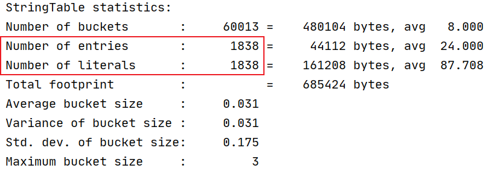

**当循环次数为100000时的结果：**

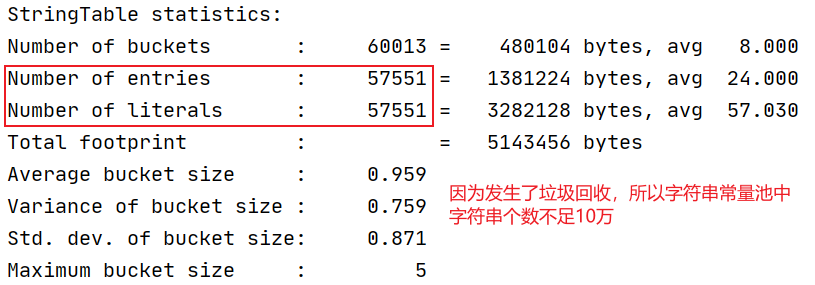

## 7 G1中的String去重操作

* 官方描述：http://openjdk.java.net/jeps/192
* 背景：对许多Java应用（有大的也有小的）做的测试得出如下结果：
  * 堆存活数据集合里面String对象占了25%
  * 堆存活数据集合里面重复的String对象有13.5%
  * String对象的平均长度时45
* 许多大规模的Java应用的瓶颈在于内存，测试表明，在这些类型的应用里面，<font color=blue>**Java堆中存活的数据集合差不多25%是String对象**</font>，更进一步，这里面差不多一半String对象是重复的，重复的意思是说：string1.equals(string2) == true; 堆上存在重复的String对象必然是一种内存的浪费。这个项目将在G1垃圾收集器中实现自动持续对重复的String对象进行去重，这样就能避免浪费内存。
* 实现
  * 当垃圾收集器工作的时候，会访问堆上存活的对象。<font color=blue>**对每个访问的对象都会检查是否是候选的要去重的String对象**</font>。
  * 如果是，把这个对象的一个引用插入到队列中等待后续的处理。一个去重的线程在后台运行，处理这个队列。处理队列的一个元素意味着从队列删除这个元素，然后尝试去重引用的String对象。
  * 使用一个hashtable来记录所有被String对象使用的不重复的char数组。当去重的时候，会查这个hashtable，来看堆上是否已经存在一个一模一样的char数组。
  * 如果存在，String对象会被调整引用那个数组，释放对原来的数组的引用，最终会被垃圾收集器回收掉。
  * 如果查找失败，char数组会被插入到hashtable，这样以后的时候就可以共享这个数组了。
* 命令行选项
  * UseStringDeduplication(bool)：开启String去重，<font color=red>**默认是不开启的，需要手动开启**</font>。
  * PrintStringDeduplicationStatistics(bool)：打印详细的去重统计信息。
  * StringDeduplicationAgeThreshold(uintx)：达到这个年龄的String对象被认为是去重的候选对象