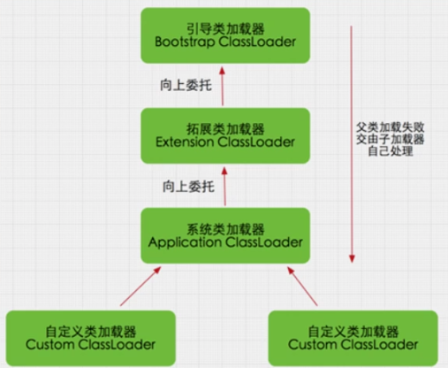
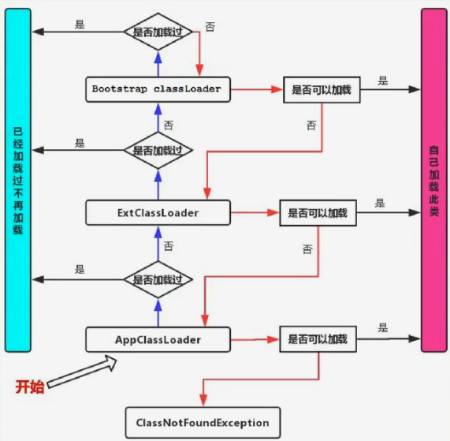

# 第21章 再谈类的加载器

## 1 概述

* 类加载器是JVM执行类加载机制的前提。

* **ClassLoader的作用：**

  ClassLoader是Java的核心组件，**所有Class**都是由ClassLoader进行加载的，ClassLoader负责通过各种方式将二进制数据流读入JVM内部，转换为一个与目标类对应的java.lang.Class对象实例。然后交给Java虚拟机进行链接、初始化等操作。因此，ClassLoader在整个装载阶段，只能影响到类的加载，而无法通过ClassLoader去改变类的链接和初始化行为。至于它是否可以运行，则由Execution Engine决定。

  

  类加载器最早出现在Java1.0版本中，那个时候只是为了单纯满足Java Applet应用而研发出来。但如今类加载器却在OSGi、字节码加密解密领域大放异彩。这主要归功于Java虚拟机的设计者们当初在设计类加载器的时候，并没有考虑将它绑定在JVM内部，这样做的好处就是能够更加灵活和动态执行类加载操作。

---

* 大厂面试题
  * ==蚂蚁金服​==
    * 深入分析ClassLoader，双亲委派机制
    * 类加载器的双亲委派模型是什么？
    * 一面：双亲委派机制及使用原因
  * ==百度==
    * 都有哪些类加载器，这些类加载器都加载哪些文件？
    * 手写一个类加载器Demo
    * Class的forName("java.lang.String") 和 Class的getClassLoader()的loadClass("java.lang.String")有什么区别？
  * ==腾讯==
    * 什么是双亲委派机制？
    * 类加载器有哪些？
  * ==小米==
    * 双亲委派机制介绍一下
  * ==滴滴==
    * 简单说一下你了解的类加载器
    * 一面：讲一下双亲委派模型，以及其优点
  * ==字节跳动==
    * 什么是类加载器，类加载器有哪些？
  * ==京东==
    * 类加载器的双亲委派模型是什么？
    * 双亲委派机制可以打破吗？为什么？

---

* **类的加载分类：显示加载 vs 隐式加载**

  class文件的显示加载与隐式加载的方式是 指JVM加载class文件到内存的方式。

  * 显示加载指的是在代码中通过调用ClassLoader加载class对象，如直接使用Class.forName(name)或this.getClass().getClassLoader().loadClass()加载class对象。
  * 隐式加载则不直接在代码中调用ClassLoader的方法加载class对象，而是通过虚拟机自动加载到内存中，如在加载某个类的class文件时，该类的class文件中引用了另一个类的对象，此时额外引用的类将通过JVM自动被加载到内存中。（new对象）

  在日常开发以上两种方式一般会混合使用。

  ```java
  public class User {
      private int id;
  
      @Override
      public String toString() {
          final StringBuilder sb = new StringBuilder("User{");
          sb.append("id=").append(id);
          sb.append('}');
          return sb.toString();
      }
  }
  ```
  
  ```java
  /**
   * @Description: 显式加载和隐式加载例子
   * @Author: Hypocrite30
   * @Date: 2021/7/12 16:28
   */
  public class UserTest {
      public static void main(String[] args) {
          User user = new User(); // 隐式加载
          try {
              Class.forName("com.hypocrite30.chapter2.package04.User"); // 显式加载
              ClassLoader.getSystemClassLoader().loadClass("com.hypocrite30.chapter2.package04.User"); // 显式加载
          } catch (ClassNotFoundException e) {
              e.printStackTrace();
          }
      }
  }
  ```

---

* 类加载器的必要性

  一般情况下，Java开发人员并不需要在程序中显示地使用类加载器，但是了解类加载器的加载机制却显得至关重要。从以下几个方面说：

  * 避免在开发中遇到java.lang.ClassNotFoundException异常或java.lang.NoClassDefFoundError异常时手足无措。只有了解类加载器的加载机制才能够在出现异常的时候快速的根据错误日志定位问题和解决问题。
  * 需要支持类的**动态加载**或需要对编译后的字节码文件进行**加密**操作时，就需要与类加载器打交道了。
  * 开发人员可以在程序中编写**自定义类加载器**重新定义类的加载规则，一遍实现一些自定义的处理逻辑。

---

* **何为类的唯一性？**

  对于任意一个类，<font color=red>**都需要由加载它的类加载器和这个类本身一同确认其在Java虚拟机中的唯一性。**</font>每一个类加载器，都拥有一个独立的类名称空间：<font color=red>**比较两个类是否相等，只有在这两个类是由同一个类加载器加载的前提下才有意义。**</font>否则，即使这两个类源自于同一个Class文件，被同一个虚拟机加载，只要加载他们的类加载器不同，那么这两个类就肯定不相同。

* 命名空间

  * 每个类加载器都有自己的命名空间，命名空间由该加载器及及所有父加载器所加载的类组成
  * 在同一命名空间中，不会出现类的完整名字（包括类的包名）相同的两个类
  * 在不同的命名空间中，有可能出现类的完整名字（包括类的包名）相同的两个类

  在大型应用中，我们往往借助这一特性，来运行同一个类的不同版本。

  ```java
  public class UserClassLoader extends ClassLoader {
      private String rootDir;
  
      public UserClassLoader(String rootDir) {
          this.rootDir = rootDir;
      }
  
      /**
       * 编写findClass方法的逻辑
       */
      @Override
      protected Class<?> findClass(String name) throws ClassNotFoundException {
          // 获取类的class文件字节数组
          byte[] classData = getClassData(name);
          if (classData == null) {
              throw new ClassNotFoundException();
          } else {
              // 直接生成class对象
              return defineClass(name, classData, 0, classData.length);
          }
      }
  
      /**
       * 编写获取class文件并转换为字节码流的逻辑 * @param className * @return
       */
      private byte[] getClassData(String className) {
          // 读取类文件的字节
          String path = classNameToPath(className);
          try {
              InputStream ins = new FileInputStream(path);
              ByteArrayOutputStream baos = new ByteArrayOutputStream();
              byte[] buffer = new byte[1024];
              int len = 0;
              // 读取类文件的字节码
              while ((len = ins.read(buffer)) != -1) {
                  baos.write(buffer, 0, len);
              }
              return baos.toByteArray();
          } catch (IOException e) {
              e.printStackTrace();
          }
          return null;
      }
  
      /**
       * 类文件的完全路径
       */
      private String classNameToPath(String className) {
          return rootDir + "\\" + className.replace('.', '\\') + ".class";
      }
  
      public static void main(String[] args) {
          String rootDir = "D:\\code\\workspace_idea5\\JVMDemo1\\chapter04\\src\\";
  
          try {
              // 创建自定义的类的加载器1
              UserClassLoader loader1 = new UserClassLoader(rootDir);
              Class clazz1 = loader1.findClass("com.atguigu.java.User");
  
              // 创建自定义的类的加载器2
              UserClassLoader loader2 = new UserClassLoader(rootDir);
              Class clazz2 = loader2.findClass("com.atguigu.java.User");
  
              System.out.println(clazz1 == clazz2);  // clazz1 与 clazz2对应了不同的类模板结构。
              System.out.println(clazz1.getClassLoader());
              System.out.println(clazz2.getClassLoader());
  
              //######################
              Class clazz3 = ClassLoader.getSystemClassLoader().loadClass("com.atguigu.java.User");
              System.out.println(clazz3.getClassLoader());
  
              System.out.println(clazz1.getClassLoader().getParent());
  
          } catch (ClassNotFoundException e) {
              e.printStackTrace();
          }
      }
  }
  ```

---

* 类加载机制的基本特征

  通常类加载机制有三个基本特征

  * 双亲委派模型。但不是所有类加载器都遵循这个模型，有的时候，启动类加载器所加载的类型，是可能要加载用户代码的，比如JDK内部的ServiceProvider/ServiceLoader机制，用户可以在标准API框架上，提供自己的实现，JDK也需要提供这些默认的参考实现。例如Java中的 JNDI、JDBC、文件系统、Cipher等很多方面，都是利用这种机制，这种情况就不会用双亲委派机制，而是利用所谓的上下文加载器。
  * 可见性，子类加载器可以访问父类加载器加载的类型，但是反过来是不允许的。不然，因为缺少必要的隔离，我们就没有办法利用类加载器实现容器的逻辑。
  * 单一性。由于父加载器的类型对于子加载器时可见的，所以父加载器加载过的类型，就不会在子加载器中重复加载。但是注意，类加载器“**邻居**”间，同一类型仍然可以被加载多次，因为相互并不可见。


## 2 类的加载器

* 类的加载器分类

  * JVM支持两种类型的类加载器，分别是<font color=red>**引导类加载器（Bootstrap ClassLoader）**</font>和<font color=red>**自定义类加载器（User-Defined ClassLoader）**</font>

  * 从概念上讲，自定义类加载器是指程序中由开发人员自定义的一类加载器，然而Java虚拟机规范却并没有这么定义，而是<font color=red>**将所有派生与抽象类ClassLoader的类加载器都划分为自定义类加载器**</font>。

  * 无论类加载器的类型如何划分，在程序中我们最常见的类加载器始终只有三个，如下图：

    

    * 除了顶层的启动类加载器外，其余的类加载器都应该有自己的“父类”加载器。

    * 不同类加载器看似继承（Inheritance）关系，实际上是**包含关系**。在下层加载器中，包含着上层加载器的引用。类似于下面的方式：

      ```java
      class ClassLoader {
          ClassLoader parent;  // 父类加载器
          
          public ClassLoader(ClassLoader parent) {
              this.parent = parent;
          }
      }
      class ParentClassLoader extends ClassLoader{
          public ParentClassLoader(ClassLoader parent) {
              super(parent);
          }
      }
      
      class ChildClassLoader extends ClassLoader{
          public ChildClassLoader(ClassLoader parent) {  // parent = new ParentClassLoader();
              super(parent);
          }
      }
      ```

---

* ==启动类加载器（引导类加载器，Bootstrap ClassLoader）==

  * 这个类加载使用<font color=red>**C/C++语言实现的**</font>，嵌套在JVM内部
  * 它用来加载Java核心类库(JAVA_HOME/jre/lib/rt.jar、resources.jar或sun.boot.class.path路径下的内容)，用于提供JVM自身需要的类
  * 并不继承自java.lang.ClassLoader，没有父加载器
  * 加载扩展类和应用程序加载器，并指定为他们的父类加载器
  * 出于安全考虑，Bootstrap启动类加载器只加载包名为java、javax、sun等开头的类

  

  

  使用-XX:+TraceClassLoading参数得到。

  * 启动类加载器使用C++编写的？Yes!
    * C/C++：指针函数&函数指针、C++支持多继承、更加高效
    * Java：由C++演变而来，(C++)--版，单继承

---

* ==扩展类加载器（Extension ClassLoader）==

  * <font color=red>**Java语言编写**</font>，由sun.misc.Launcher$ExtClassLoader实现。

  * <font color=red>**派生于ClassLoader类**</font>

  * 父类加载器为启动类加载器

  * 从java.ext.dirs系统属性所指定的目录加载类库，或从JDK安装目录的jre/lib/ext子目录（扩展目录）下加载类库。<font color=red>**如果用户创建的JAR放在此目录下，也会自动由扩展类加载器加载**</font>。

    

    

---

* ==应用程序类加载器（系统类加载器，AppClassLoader）==
  * java语言编写，由sun.misc.Launcher$AppClassLoader实现。
  * <font color=red>**派生于ClassLoader类**</font>
  * 父类加载器为启动类加载器
  * 它负责加载环境变量classpath或系统属性java.class.path指定路径下的类库
  * <font color=red>**应用程序中的类加载器默认是系统类加载器**</font>，一般来说，Java应用的类都是由它来完成加载
  * 它是用户自定义加载器的默认父加载器
  * 通过`ClassLoader.getSystemClassLoader()`方法可以获取到该类加载器

---

* ==用户自定义类加载器==
  * 在Java日常应用程序开发中，类的加载几乎是由上述3种加载器相互配合执行的，在必要时，我们还可以自定义类加载器，来定制类的加载方式。
  * 体现Java语言强大生命力和巨大魅力的关键因素之一便是：Java开发者可以自定义类加载器来实现类库的动态加载，加载源可以是本地的JAR包，也可以是网络上的远程资源。
  * <font color=red>**通过类加载器可以实现非常绝妙的插件机制**</font>，这方面的实际应用举不胜举。例如，著名的OSGI组件框架，再如Eclipse的插件机制。类加载器为应用程序提供了一种动态增加新功能的机制，这种机制无需重新打包发布应用程序就能实现。
  * 同时，<font color=red>**自定义加载器能够实现应用隔离**</font>，例如Tomcat，Spring等中间件和组件框架都在内部实现了自定义的加载器，并通过自定义加载器隔离不同的组件模块。这种机制比C/C++程序要好太多，想不修改C/C++程序就能为其新增功能，几乎是不可能的，仅仅一个兼容性便能阻挡住所有美好的设想。
  * 自定义类加载器通常需要继承于ClassLoader（但是注意自定义类加载器.getParent()是系统类加载器AppClassLoader）。


## 3 测试不同的类加载器

* 每个Class对象都会包含一个定义它的ClassLoader的一个引用

* 获取ClassLoader的途径：

  * 获得当前类的ClassLoader：

    ```java
    clazz.getClassLoader();
    ```

  * 获得当前线程上下文的ClassLoader(就是**系统类加载器**，Launcher的无参构造里有设置)：

    ```java
    Thread.currentThread().getContextClassLoader();
    ```

  * 获得系统的ClassLoader：

    ```java
    ClassLoader.getSystemClassLoader();
    ```

  **说明：**

  站在程序员的角度看，引导加载器与另外两种类加载器（系统类加载器 和 扩展类加载器）并不是同一个层次意义上的加载器，引导类加载器是使用C++语言编写的，而另外两类加载器则是使用Java语言编写的。由于引导类加载器压根儿就不是一个Java类，因此Java程序中只能打印出空值（null）。

* 数组类的Class对象，不是由类加载器去创建的。对于数组类的类加载器来说，是通过Class.getClassLoader()返回的，与数组当中元素类型的类加载器时一样的；如果数组当中的元素类型是基本数据类型，数组类是没有加载器的。

```java
public class ClassLoaderTest1 {
    public static void main(String[] args) {
        // 获取系统该类加载器
        ClassLoader systemClassLoader = ClassLoader.getSystemClassLoader();
        System.out.println(systemClassLoader);  // sun.misc.Launcher$AppClassLoader@18b4aac2
        // 获取扩展类加载器
        ClassLoader extClassLoader = systemClassLoader.getParent();
        System.out.println(extClassLoader);  // sun.misc.Launcher$ExtClassLoader@1540e19d
        // 试图获取引导类加载器：失败
        ClassLoader bootstrapClassLoader = extClassLoader.getParent();
        System.out.println(bootstrapClassLoader);  // null

        // ###########################
        try {
            ClassLoader classLoader = Class.forName("java.lang.String").getClassLoader();
            System.out.println(classLoader); // null - String 是由引导类加载器加载的
            // 自定义的类默认使用系统类加载器
            ClassLoader classLoader1 = Class.forName("com.hypocrite30.chapter2.package04.ClassLoaderTest1").getClassLoader();
            System.out.println(classLoader1); // sun.misc.Launcher$AppClassLoader@18b4aac2

            // 关于数组类型的加载:使用的类的加载器与数组元素的类的加载器相同
            String[] arrStr = new String[10];
            System.out.println(arrStr.getClass().getClassLoader());  // null - 表示使用的是引导类加载器

            ClassLoaderTest1[] arr1 = new ClassLoaderTest1[10];
            System.out.println(arr1.getClass().getClassLoader());  // sun.misc.Launcher$AppClassLoader@18b4aac2

            int[] arr2 = new int[10];
            System.out.println(arr2.getClass().getClassLoader());  // null - 基础数据类型不需要类的加载器


            System.out.println(Thread.currentThread().getContextClassLoader()); // 当前线程上下文加载器就是系统类加载器
        } catch (ClassNotFoundException e) {
            e.printStackTrace();
        }
    }
}
```


## 4 ClassLoader源码解析

* ClassLoader与现有类加载器的关系

  

  除了以上虚拟机自带的加载器外，用户还可以定制自己的类加载器。Java提供了抽象类java.lang.ClassLoader，所有用户自定义的类加载器都应该继承ClassLoader类。

---

* 抽象类ClassLoader的主要方法

  * ```java
    public final ClassLoader getParent();
    ```

    返回该类的超类加载器

  * ```java
    public Class<?> loadClass(String name) throws ClassNotFoundException
    ```

    加载名称为name的类，返回结果为java.lang.Class类的实例。如果找不到类，则返回ClassNotFoundException异常。==该方法中的逻辑就是双亲委派模式的实现==。

    测试代码：

    ```java
    ClassLoader.getSystemClassLoader().loadClass("com.hypocrite30.java.User");
    ```

    源码剖析：

    ```java
    public Class<?> loadClass(String name) throws ClassNotFoundException {
        return loadClass(name, false);
    }
    
    protected Class<?> loadClass(String name, boolean resolve)  // resolve: true-加载class的同时进行解析操作
        throws ClassNotFoundException
    {
        synchronized (getClassLoadingLock(name)) {  // 同步操作，保证只能加载一次
            // 首先，在缓存中判断是否已经加载过同名的类
            Class<?> c = findLoadedClass(name);
            if (c == null) {
                long t0 = System.nanoTime();
                try {
                    // 获取当前类的父类加载器
                    if (parent != null) {
                        // 如果存在父类加载器，则调用父类加载器进行类的加载
                        // 这里递归调用，就体现出双亲委派机制！！！
                        c = parent.loadClass(name, false);
                    } else {  // parent为null：父类加载器时引导（启动）类加载器
                        c = findBootstrapClassOrNull(name);
                    }
                } catch (ClassNotFoundException e) {
                    // ClassNotFoundException thrown if class not found
                    // from the non-null parent class loader
                }
    
                if (c == null) {  // 当前类的加载器的父类加载器未加载此类 or 当前类的加载器未加载此类
                    // 调用当前ClassLoader 的 findClass()
                    long t1 = System.nanoTime();
                    c = findClass(name);
    
                    // this is the defining class loader; record the stats
                    sun.misc.PerfCounter.getParentDelegationTime().addTime(t1 - t0);
                    sun.misc.PerfCounter.getFindClassTime().addElapsedTimeFrom(t1);
                    sun.misc.PerfCounter.getFindClasses().increment();
                }
            }
            if (resolve) {  // 是否解析
                resolveClass(c);
            }
            return c;
        }
    }
    ```
    
  * 📌上面第 18 行，`c = parent.loadClass(name, false);` 递归调用即体现出「**双亲委派机制**」
    
    
  
    ```java
    protected Class<?> findClass(String name) throws ClassNotFoundException
    ```
  
    该类在URLClassLoader中被重写，作用是查找二进制名称为name的类，返回结果为java.lang.Class类的实例。这是一个受保护的方法，JVM鼓励我们重写此方法，需要自定义加载器遵循双亲委派机制，该方法会在检查完父类加载器之后被loadClass()方法调用。
  
    在JDK1.2之前，在自定义类加载时，总会去继承ClassLoader类并重写loadClass方法，从而实现自定义的类加载类。但是在JDK1.2之后不再建议用户去覆盖loadClass()方法，而是建议把自定义的类加载逻辑写在findClass()方法中，从前面的分析可知，findClass()方法是在loadClass()方法中被调用的，当loadClass()方法中的父类加载器失败之后，则会调用自己的findClass()方法来完成类加载，这样就可以保证自定义的类加载器也符合**双亲委派模式**。
  
    需要注意的是ClassLoader类中并没有实现findClass()方法的具体代码逻辑，取而代之的是抛出ClassNotFoundException异常，同时应该知道的是findClass方法通常是和defineClass方法一起使用的。<font color=red>**一般情况下，在自定义类加载器时，会直接覆盖ClassLoader的findClass()方法并编写加载规则，取得要加载类的字节码后转换成流，然后调用defineClass()方法生成类的Class对象**</font>。
    
    URLClassLoader中被重写findClass源码：
    
    ```java
    protected Class<?> findClass(final String name)
        throws ClassNotFoundException
    {
        final Class<?> result;
        try {
            result = AccessController.doPrivileged(
                new PrivilegedExceptionAction<Class<?>>() {
                    public Class<?> run() throws ClassNotFoundException {
                        String path = name.replace('.', '/').concat(".class");
                        Resource res = ucp.getResource(path, false);
                        if (res != null) {
                            try {
                                return defineClass(name, res);
                            } catch (IOException e) {
                                throw new ClassNotFoundException(name, e);
                            }
                        } else {
                            return null;
                        }
                    }
                }, acc);
        } catch (java.security.PrivilegedActionException pae) {
            throw (ClassNotFoundException) pae.getException();
        }
        if (result == null) {
            throw new ClassNotFoundException(name);
        }
        return result;
    }
    ```
    
    ```java
    protected final Class<?> defineClass(String name, byte[] b, int off, int len)
    ```
    
    根据给定的字节数组 b 转换为Class的实例，off和len参数表示实际Class信息在byte数组中的位置和长度，其中byte数组 b 是ClassLoader从外部获取的。这是受保护的方法，只有在自定义ClassLoader**子类**中可以使用。
    
    defineClass() 方法是用来将byte字节流解析成JVM能够识别的Class对象（ClassLoader中已经实现该方法的逻辑），通过这个方法不仅能够通过class文件实例化class对象，也可以通过其他方式实例化class对象，如通过网络接收一个类的字节码，然后转换为byte字节流创建对应的Class对象。
    
    <font color=red>**defineClass()方法通常与findClass()方法一起适用，一般情况下，在自定义类加载器时，会直接覆盖ClassLoader的findClass()方法并编写加载规则，取得要加载类的字节码后转换成流，然后调用defineClass()方法生成类的Class对象**</font>。
    
  * ```java
    protected final void resolveClass(Class<?> c)
    ```
  
    链接指定的一个Java类。适用该方法可以使类的Class对象创建完成的同时也被**解析**
  
  * ```java
    protected final Class<?> findLoadedClass(String name)
    ```
  
    查找名称为name的已经被加载过的类，返回结果为java.lang.Class类的实例。这个方法是final方法，无法被修改。
  
  * ```java
    private final ClassLoader parent;
    ```
  
    它也是一个ClassLoader的实例，这个字段所表示的ClassLoader也称为这个ClassLoader的双亲。在类加载的过程中，ClassLoader可能会将某些请求交予自己的双亲处理。

---

* **SecureClassLoader 与 URLClassLoader**

  * 接着SecureClassLoader 扩展了 ClassLoader，新增了几个与使用相关的代码源（对代码源的位置及其整数的验证）和权限定义类验证（主要指对class源码的访问权限）的方法，一般我们不会直接跟这个类打交道，更多的是与它的子类URLClassLoader有所关联。

  * 前面说过，ClassLoader是一个抽象类，很多方法是空的没有实现，比如 findClass()、findResource()等。而URLClassLoader这个实现类提供了具体的实现。并且新增了URLClassPath类协助取得Class字节码流等功能。<font color=red>**在编写自定义类加载器时，如果没有太过于复杂的需求，可以直接继承URLClassLoader类，**</font>这样就可以避免自己去编写findClass()方法及其获取字节流的方式，使自定义类加载器编写更加简洁。

    

---

* **ExtClassLoader 与 AppClassLoader**

  * 了解完URLClassLoader后接着看看剩余的两个类加载器，即扩展类加载器ExtClassLoader和系统类加载器AppClassLoader，这两个类都继承自URLClassLoader，是sun.misc.Launcher的静态内部类。sun.misc.Launcher主要被系统用于启动主应用程序，ExtClassLoader和AppClassLoader都是由sun.misc.Launcher创建的，其类主要类结构如下：

    

    我们发现ExtClassLoader并没有重写loadClass()方法，这足以说明其遵循双亲委派模式，而AppClassLoader重载了loadClass()方法，但是最终调用的还是父类loadClass()方法，因此依然遵守双亲委派模式。

---

* Class.forName() 与 ClassLoader.loadClass()：
  * Class.forName()：是一个静态方法，最宠用的是Class.forName(String className); 根据传入的类的全限定名返回一个Class对象。<font color=red>**该方法在将Class文件加载到内存的同时，会执行类的初始化（主动使用）。**</font>如：Class.forName("com.atguigu.java.helloWorld");
  * ClassLoader.loadClass()：这是一个实例方法，需要一个ClassLoader对象来调用该方法。<font color=red>**该方法在将Class文件加载到内存的同时，并不会执行类的初始化（被动使用），直到这个类第一次使用时才进行初始化。**</font>该方法因为需要得到一个ClassLoader对象，所以可以根据需要制定使用哪个类加载器，如ClassLoader cl = ......; cl.loadClass("com.atguigu.java.helloWorld");


## 5 双亲委派模型

类加载器用来把类加载到Java虚拟机中。从JDK1.2版本开始，类的加载过程采用双亲委派机制，这种机制能更好地保证Java平台的安全。

* **定义**

  如果一个类加载器在接到加载类的请求时，它首先不会自己尝试去加载这个类，而是把这个请求任务委托给父类加载器去完成，一次递归，如果父类加载器可以完成类加载任务，就成功返回。只有父类加载器无法完成此加载任务时，才自己去加载。

* **本质**

  规定了类加载的顺序是：引导类加载器，若加载不到，由扩展类加载器加载，若还加载不到，才会由系统类加载器或自定义的类加载器进行加载。

  

  

---

* **双亲委派机制的优势**

  * 避免类的重复加载，确保一个类的全局唯一性

    <font color=red>**Java类随着它的类加载器一起具备了一种带有优先级的层次关系，通过这种层次关系可以避免类的重复加载，**</font>当父类已经加载了该类时，就没有必要子ClassLoader再加载一次。

  * 保护程序安全，防止核心API被随意篡改

* **代码支持**

  双亲委派机制在java.lang.ClassLoader.loadClass(String, boolean)接口中体现。该接口的逻辑如下：

  （1）先在当前加载器的缓存中查找有无目标类，如果有，直接返回。

  （2）判断当前加载器的父加载器是否为空，如果不为空，则调用parent.loadClass(name, false)接口进行加载。

  （3）反之，如果当前加载器的父类加载器为空，则调用findBootstrapClassOrNull(name)接口，让引导类加载器进行加载。

  （4）如果通过以上3条路径都没能成功加载，则调用findClass(name)接口进行加载。该接口最终会调用java.lang.ClassLoader接口的defineClass系列的native接口加载目标类。

  双亲委派模型就隐藏在这第 2 和第 3 步中。

* **举例**

  假设当前加载的是java.lang.Object这个类，很显然，该类属于JDK中核心的不能再核心的一个类，因此一定只能由引导类加载器进行加载。当JVM准备加载java.lang.Object时，JVM默认会使用系统类加载器去加载，按照上面4步加载的逻辑，在第1 步从系统类的缓存中肯定查找不到该类，于是进入第 2 步。由于从系统类加载器的父加载器是扩展类加载器，于是扩展类加载器继续从第 1 步开始重复。由于扩展类加载器的缓存中也一定查不到该类。因此进入第 2 步。扩展类的加载器是null，因此系统调用findClass(String)，最终通过引导类加载器进行加载。

* **思考**

  如果在自定义的类加载器中重写java.lang.ClassLoader.loadClass(String)或java.lang.ClassLoader.loadClass(String， boolean)方法，抹去其中的双亲委派机制，仅保留上面这 4 步中的第 1 步和第 4 步，那么是不是就能够加载核心类库了呢？

  这也不行！因为JDK还未核心类库提供了一层保护机制。不管是自定义的类加载器，还是系统类加载器亦或是扩展类加载器，最终都必须调用java.lang.ClassLoader.defineClass(String, byte[], int, int, ProtectionDomin)方法，而该方法会执行<font color=red>**preDefineClass()接口**</font>，该接口中提供了对JDK核心类库的保护。

* **双亲委派机制的弊端**

  检查类是否加载的委托过程是单向的，这个方式虽然从结构上说比较清晰，使各个ClassLoader的职责非常明确，但是同时会带来一个问题，即顶层的ClassLoader无法访问底层的ClassLoader所加载的类。

  通常情况下，启动类加载器中的类为系统核心类，包括一些重要的系统接口，而在应用类加载器中，为应用类。按照这种模式，<font color=red>**应用类访问系统类自然没有问题，但是系统类访问应用类就会出现问题。**</font>比如在系统类中提供了一个接口，该接口需要在应用类中得以实现，该接口需要在应用类中得以实现，改接口还绑定一个工厂方法，用于创建改接口的实例，而接口和工厂方法都在启动类加载器中。这是，就会出现该工厂方法无法创建由应用（系统）类加载器加载的应用实例的问题。

* **结论**

  <font color=red>**由于Java虚拟机规范并没有明确要求类加载器的加载一定要使用双亲委派模型，只是建议采用这种方式而已。**</font>

  比如在Tomcat中，类加载器所采用的加载机制和传统的双亲委派模型有一定区别，当缺省的类加载器接收到一个类的加载任务时，首先会由它自行加载，当它加载失败时，才会将类的加载任务委派给它的超类加载器去执行，这同时也是Servlet规范推荐的一种做法。

---

* **破坏双亲委派机制**

  双亲委派模型并不是一个具有强制性约束的模型，而是Java设计者推荐给开发者们的类加载器实现方式。

  在Java的世界中大部分的类加载器都遵循这个模型，但也有例外的情况，知道Java模块化出现为止，双亲委派模型主要出现过 3 次较大规模“被破坏”的情况。

  * 破坏双亲委派机制1

    双亲委派模型的第一次“被破坏”其实发生在双亲委派模型出现之前------即JDK1.2面世以前的“远古”时代。

    由于双亲委派模型在JDK1.2之后才被引入，但是类加载器的概念和抽象类java.lang.ClassLoader则在Java的第一个版本中就已经存在，面对已经存在的用户自定义类加载器的代码，Java设计者们引入双亲委派机制模型时不得不做出一些妥协，<font color=red>**为了兼容这些已有代码，无法再以技术手段避免loadClass()被子类覆盖的可能性**</font>，只能在JDK1.2之后的java.lang.ClassLoader中添加一个新的protected方法findClass()，并引导用户编写的类加载器逻辑时尽可能去重写这个方法，而不是在loadClass()中编写代码。上节我们已经分析过loadClass()方法，双亲委派的具体逻辑就实现在这里面，按照loadClass()方法的逻辑，如果父类加载失败，会自动调用自己的findClass()方法来完成加载，这样既不影响用户按照自己的意愿去加载类，又可以保证新写出的类加载器时符合双亲委派规则的。

  * 破坏双亲委派机制2：线程上下文类加载器

    双亲委派模型的第二次“被破坏”是由这个模型的缺陷导致的，双亲委派很好的解决了各个类加载器协作时基础类型的一致性问题（<font color=red>**越基础的类由越上层的加载器加载**</font>），基础类型之所以被称为“基础”，是因为他们总是作为被用户代码继承、调用的Api存在，但程序设计往往没有绝对不变的完美规则，<font color=red>**如果有基础类型又要调用用户的代码，那该怎么办呢？**</font>

    这并非是不可能出现的事情，一个典型的例子便是JNDI服务，JNDI现在已经是Java的标准服务，它的代码由启动类加载器完成加载（在JDK1.3时加入到rt.jar的），肯定属于Java很基础的类型了。但JNDI存在的目的就是对资源进行查找和集中管理，它需要调用由其他厂商实现并部署在应用程序的ClassPath下的JNDI服务提供者接口（Service Provider Interface，SPI）的代码，现在问题来了，<font color=red>**启动类加载器是绝不可能认识、加载这些代码的，那该怎么办？**</font>（SPI：在Java平台中，通常把核心类rt.jar中提供外部服务、可由应用层自行实现的接口称为SPI）

    为了解决这个困境，Java设计团队只好引入一个不太优雅的设计：<font color=red>**线程上下文类加载器（Thread Context ClassLoader）**</font>。这个类加载器可以通过java.lang.Thread类的setContextClassLoader()方法进行设置，如果创建线程时还未设置，它将会从父类线程中继承一个，如果在应用程序的全局范围内都没有设置的话，那这个类加载器默认就是应用程序类加载器。

    有了线程上下文类加载器，程序就可以做一些“舞弊”的事情了：JNDI服务使用这个线程上下文类加载器去加载所需要的SPI服务代码，<font color=red>**这是一种父类加载器去请求子类加载器完成类加载的行为，这种行为实际上是打通了双亲委派模型的层次结构来你想使用类加载器，已经违背了双亲委派模型的一般性原则**</font>，但也是无可奈何的事情。Java中涉及SPI的加载基本上都采用这种方式来完成，例如JNDI、JDBC、JCE、JAXB和JBI等。不过，当SPI的服务提供者多于一个的时候，代码就只能根据具体提供者的类型来硬编码判断，为了消除这种极不优雅的实现方式，在JDKK 6 时，JDK提供了一种相对合理的解决方案。

    

    默认上下文加载器就是应用（系统）类加载器，这样以上下文加载器为终结，使得启动类加载器中的代码就可以访问应用（系统）类加载器中的类。

  * 破坏双亲委派机制3

    实现代码的热替换。在OSGi环境下，类加载器不再是双亲委派模型推进的树状结构，而是进一步发展为更加复杂的<font color=red>**网状结构**</font>。

    当收到类加载请求时，OSGi将按照下面的顺序进行类搜索：

    <font color=red>**1）将以java.*开头的类，委派给父类加载器加载。**</font>

    <font color=red>**2）否则，将委派列表名单中的类，委派给父类加载器加载。**</font>

    3）否则，将Import列表中的类，委派给Export这个类的Bundle的类加载器加载。

    4）否则，查找当前Bundle的ClassPath，使用自己的类加载器加载。

    5）否则，查找类是否在自己的Fragment Bundle中，如果在，则委派给Fragment Bundle的类加载器加载。

    6）否则，查找Dynamic Import列表中的Bundle，委派给对应Bundle的类加载器加载。

    7）否则，类查找失败

    说明：这里开头两点仍然符合双亲委派模型原则的行为，其余的类查找都是在平级的类加载器中进行的。

* 小节：

  这里，我们使用了“被破坏”这个词来形容上述不符合双亲委派模型原则的行为，但<font color=red>**这里“被破坏”并不一定是带有贬义的。只要有明确的目的和充分的理由，突破就有原则无疑是一种创新。**</font>

  正如：OSGi中的类加载器的设计不符合传统的双亲委派模型的类加载器架构，且业界对其为了实现热部署而带来的额外的高复杂度还存在不少争议，但对这方面有了解的技术人员基本还能达成一个共识，认为**OSGi中对类加载器的运用是值得学习的，完全弄懂了OSGi的实现，就算掌握了类加载器的精髓**。

---

* **热替换的实现**

  热替换是指程序在运行过程中，不停止服务，只通过替换程序文件来修改程序的行为。<font color=red>**热替换的关键需求在于服务不能中断，修改必须立即表现在运行的系统之中。**</font>基本上大部分脚本语言都是天生支持热替换的，比如：PHP，只要替换了PHP文件，这种改动就会立即生效，无需重启Web服务器。

  但是对于Java来说，热替换并非天生就支持，如果一个类已经加载到系统中，通过修改类文件，并无法让系统再来加载并重新定义这个类。因此，在Java中实现这一功能的一个可行的方法就是灵活运用ClassLoader。

  注意：由不同ClassLoader加载的同名类属于不同的类型，不能相互转换和兼容。即两个不同的ClassLoader加载同一个类，在虚拟机内部，会认为这 2 个类是完全不同的。

  根据这个特点，可以用来模拟热替换的实现，基本思路如下图所示：

  
  
  例子：
  
  ```java
  // 自定义类的加载器
  public class MyClassLoader extends ClassLoader {
      private String rootDir;
  
      public MyClassLoader(String rootDir) {
          this.rootDir = rootDir;
      }
  
      protected Class<?> findClass(String className) throws ClassNotFoundException {
          Class clazz = this.findLoadedClass(className);
          FileChannel fileChannel = null;
          WritableByteChannel outChannel = null;
          if (null == clazz) {
              try {
                  String classFile = getClassFile(className);
                  FileInputStream fis = new FileInputStream(classFile);
                  fileChannel = fis.getChannel();
                  ByteArrayOutputStream baos = new ByteArrayOutputStream();
                  outChannel = Channels.newChannel(baos);
                  ByteBuffer buffer = ByteBuffer.allocateDirect(1024);
                  while (true) {
                      int i = fileChannel.read(buffer);
                      if (i == 0 || i == -1) {
                          break;
                      }
                      buffer.flip();
                      outChannel.write(buffer);
                      buffer.clear();
                  }
  
                  byte[] bytes = baos.toByteArray();
                  clazz = defineClass(className, bytes, 0, bytes.length);
  
  
              } catch (FileNotFoundException e) {
                  e.printStackTrace();
              } catch (IOException e) {
                  e.printStackTrace();
              } finally {
                  try {
                      if (fileChannel != null)
                          fileChannel.close();
                  } catch (IOException e) {
                      e.printStackTrace();
                  }
                  try {
                      if (outChannel != null)
                          outChannel.close();
                  } catch (IOException e) {
                      e.printStackTrace();
                  }
              }
          }
          return clazz;
      }
  
      /**
       * 类文件的完全路径
       */
      private String getClassFile(String className) {
          return rootDir + "\\" + className.replace('.', '\\') + ".class";
      }
  }
  ```
  
  ```java
  public class Demo1 {
      public void hot() {
          System.out.println("OldDemo1---->newDemo1");
      }
  }
  ```
  
  ```java
  public class LoopRun {
      public static void main(String args[]) {
          while (true) {
              try {
                  // 1. 创建自定义类加载器的实例
                  MyClassLoader loader = new MyClassLoader("D:\\code\\workspace_idea5\\JVMDemo1\\chapter04\\src\\");
                  // 2. 加载指定的类
                  Class clazz = loader.findClass("com.atguigu.java1.Demo1");
                  // 3. 创建运行时类的实例
                  Object demo = clazz.newInstance();
                  // 4. 获取运行时类中指定的方法
                  Method m = clazz.getMethod("hot");
                  // 5. 调用指定的方法
                  m.invoke(demo);
                  Thread.sleep(5000);
              } catch (Exception e) {
                  System.out.println("not find");
                  try {
                      Thread.sleep(5000);
                  } catch (InterruptedException ex) {
                      ex.printStackTrace();
                  }
              }
          }
      }
  }
  ```
  
  
  
  


## 6 沙箱安全机制

* 沙箱安全机制

  * 保护程序安全
  * 保护Java原生的JDK代码

  <font color=red>**Java安全模型的核心就是Java沙箱（sandbox）**</font>。什么是沙箱？沙箱是一个限制程序运行的环境。

  沙箱机制就是将Java代码<font color=red>**限定在虚拟机（JVM）特定的运行范围中，并且严格限制代码对本地资源的访问。**</font>通过这样的措施来保证对代码的有限隔离，防止对本地系统造成破坏。

  沙箱主要限制系统资源访问，那系统资源包括什么？CPU、内存、文件系统、网络。不同级别的沙箱对这些资源访问的限制也可以不一样。

  所有的Java程序都可以指定沙箱，可以指定安全策略。

* JDK1.0时期

  

* JDK1.1时期

  

* JDK1.2时期

  

* JDK1.6时期

  


## 7 自定义类的加载器

* **为什么需要自定义类加载器？**

  * <font color=red>**隔离加载类**</font>

    在某些框架内进行中间件与应用模块隔离，把类加载到不同的环境。比如：阿里内某容器框架通过自定义类加载器确保**应用中**依赖的jar包不会影响到**中间件**运行时使用的jar包。再比如：Tomcat这类Web应用服务器，内部自定义了好几种类加载器，用于隔离同一个Web应用服务器上不同应用程序。（类的仲裁---->类冲突）

  * <font color=red>**修改类加载的方式**</font>

    类的加载模型并非强制，除Bootstrap外，其他的加载并非一定要引入，或者根据实际情况在某个时间点按需进行动态加载。

  * <font color=red>**扩展加载源**</font>

    比如从数据库、网络、甚至是电视机顶盒进行加载

  * <font color=red>**防止源码泄露**</font>

    Java代码容易被编译和篡改，可以进行编译加密，那么类加载也需要自定义，还原加密的字节码。

* **常见的场景**

  * 实现类似进程内隔离，类加载实际上用作不同的命名空间，以提供类似容器、模块化的效果。例如，两个模块依赖于某个类库的不同版本，如果分别被不同的容器加载，就可以互不干扰。这方面的集大成者是Java EE和OSGi、JPMS等框架。
  * 应用需要从不同的数据源获取类定义信息，例如网络数据源，而不是本地文件系统。或者是需要自己操纵字节码，动态修改或者生成类型。

* **注意：**

  在一般情况下，使用不同的类加载器去加载不同的功能模块，会提高应用程序的安全性。但是，如果涉及Java类型转换，则加载器反而容易产生不美好的事情。在做Java类型转换时，只有两个类型都是由同一个加载器所加载，才能进行进行类型转换，否则转换时会发生异常。

---

用户通过定制自己的类加载器，这样可以重新定义类的加载规则，以便实现一些自定义的处理逻辑。

* **实现方式**

  * Java提供了抽象类java.lang.ClassLoader，所有用户自定义的类加载器都应该继承ClassLoader类。
  * 在自定义 ClassLoader 的子类的时候，我们常见的会有两种做法：
    * 方式一：重写loadClass()方法
    * 方式二：重写findClass()方法  ----> **推荐**

* **对比**

  这两种方法本质上差不多，毕竟loadClass()也会调用findClass()，但是从逻辑上讲我们最好不要直接修改loadClass()的内部逻辑。建议的做法是只在findClass()里重写自定义类的加载方法，根据参数指定类的名字，返回对应的Class对象的引用。

  * loadClass()这个方法是实现双亲委派模型逻辑的地方，擅自修改这个方法会导致模型结构被破坏，容易造成问题。<font color=red>**因此我们最好是在双亲委派模型框架内进行小范围改动，不破坏原有的稳定结构。**</font>同时，也避免了自己重写loadClass()方法的过程中必须写双亲委派的重复代码，从代码的复用性来看，不直接修改这个方法始终是比较好的选择。
  * 当编写好自定义的类加载器后，便可以在程序中调用loadClass()方法来实现类加载操作。

* **说明**

  * 其父类加载器是系统类加载器
  * JVM中的所有类加载都会使用java.lang.ClassLoader.loadClass(String)接口（自定义类加载器并重写java.lang.ClassLoader.loadClass(String)接口的除外），连JDK的核心类库也不能例外。

* 例子

  ```java
  /**
   * 自定义ClassLoader
   */
  public class MyClassLoader extends ClassLoader {
      private String byteCodePath;
  
      public MyClassLoader(String byteCodePath) {
          this.byteCodePath = byteCodePath;
      }
  
      public MyClassLoader(ClassLoader parent, String byteCodePath) {
          super(parent);
          this.byteCodePath = byteCodePath;
      }
  
      @Override
      protected Class<?> findClass(String className) throws ClassNotFoundException {
          BufferedInputStream bis = null;
          ByteArrayOutputStream baos = null;
          try {
              // 获取字节码文件的完整路径
              String fileName = byteCodePath + className + ".class";
              // 获取一个输入流
              bis = new BufferedInputStream(new FileInputStream(fileName));
              // 获取一个输出流
              baos = new ByteArrayOutputStream();
              // 具体读入数据并写出的过程
              int len;
              byte[] data = new byte[1024];
              while ((len = bis.read(data)) != -1) {
                  baos.write(data, 0, len);
              }
              // 获取内存中的完整的字节数组的数据
              byte[] byteCodes = baos.toByteArray();
              // 调用defineClass()，将字节数组的数据转换为Class的实例。
              Class clazz = defineClass(null, byteCodes, 0, byteCodes.length);
              return clazz;
          } catch (IOException e) {
              e.printStackTrace();
          } finally {
              try {
                  if (baos != null)
                      baos.close();
              } catch (IOException e) {
                  e.printStackTrace();
              }
              try {
                  if (bis != null)
                      bis.close();
              } catch (IOException e) {
                  e.printStackTrace();
              }
          }
          return null;
      }
  }
  ```

  ```java
  public class MyClassLoaderTest {
      public static void main(String[] args) {
          MyClassLoader loader = new MyClassLoader("d:/");
  
          try {
              Class clazz = loader.loadClass("Demo1");
              System.out.println("加载此类的类的加载器为：" + clazz.getClassLoader().getClass().getName());
  
              System.out.println("加载当前Demo1类的类的加载器的父类加载器为：" + clazz.getClassLoader().getParent().getClass().getName());
          } catch (ClassNotFoundException e) {
              e.printStackTrace();
          }
      }
  }
  ```

  结果：

  加载此类的类的加载器为：com.atguigu.java2.MyClassLoader
  加载当前Demo1类的类的加载器的父类加载器为：sun.misc.Launcher$AppClassLoader


## 9 Java9新特性


