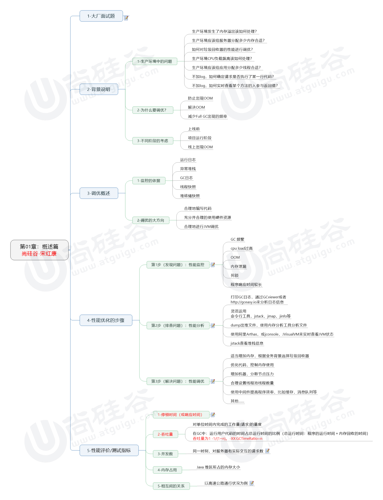

# 第22章 性能监控与调优概述

## 1 大厂面试题

* ==支付宝==
  * 支付宝三面：JVM性能调优都做了什么？
* ==小米==
  * 有做过JVM内存优化吗？
  * 从SQL、JVM、架构、数据库四个方面讲讲优化思路
* ==蚂蚁金服==
  * JVM的编译优化
  * JVM性能调优都做了什么
  * JVM诊断工具用过哪些？
  * 二面：JVM怎样调优，堆内存、栈空间设置多少合适
  * 三面：JVM相关的分析工具使用过哪些？具体的性能优化步骤如何？

* ==字节跳动==
  * 三面：JVM如何调优、参数怎么调？
* ==拼多多==
  * 从SQL、JVM、架构、数据库四个方面讲讲优化思路
* ==京东==
  * JVM诊断工具用过哪些？
  * 每秒几十万并发的秒杀系统为什么会频繁发生GC？
  * 日均百万级交易系统如何优化JVM？
  * 线上生产系统OOM如何监控及定位与解决？
  * 高并发系统如何基于G1垃圾回收器优化性能？

## 2 背景说明

### 2.1 生产环境中的问题

* 生产环境发生内存溢出该如何处理？
* 生产环境应该给服务器分配多少内存合适？
* 如何对垃圾回收器的性能进行调优？
* 生产环境CPU负载飙高该如何处理？
* 生产环境应该给应用分配多少线程合适？
* 不加log，如何确定请求是否执行了某一行代码？
* 不加log，如何实时查看某个方法的入参与返回值？

### 2.2 为什么要调优？

* 防止出现OOM
* 解决OOM
* 减少Full GC出现的频率

### 2.3 不同阶段的考虑

* 上线前
* 项目运行阶段
* 线上出现OOM

## 3 调优的概述

### 3.1 监控的依据

* 运行日志
* 异常堆栈
* GC日志
* 线程快照
* 堆转储快照

### 3.2 调优的大方向

* 合理的编写代码
* 充分并合理的使用硬件资源
* 合理的进行JVM调优

## 4 性能优化的步骤

* 第一步（发现问题）：**性能监控**

  一种以非强行或者入侵方式**收集或查看**应用运行性能数据的活动。监控通常是指一种在生产、质量评估或者开发环境下实施的带有**预防或主动性**的活动。当应用相关干系人提出性能问题却**没有提供足够多的线索时**，首先我们需要进行性能监控，随后是性能分析。

  * GC频繁
  * CPU load过高
  * OOM
  * 内存泄露
  * 死锁
  * 程序相应时间较长

* 第二步（排查问题）：**性能分析**
  
  一种以**侵入方式**收集运行性能问题的答复结果，它会影响应用的吞吐量或响应性。性能分析是针对性能问题的答复结果，关注的范围通常比性能监控更加集中。性能分析很少在生产环境下进行，通常是在质量评估、**系统测试或者开发环境下进行**，是性能监控之后的步骤。
  
  * 打印GC日志，通过GCviewer或者[gceasy](https://gceasy.io/)来分析日志信息
  * 灵活运用命令行工具，jstack、jmap、jinfo等
  * dump出堆文件，使用内存分析工具分析文件
  * 使用阿里Arthas或jconsole，JVisualVM来实时查看JVM状态
  * jstack查看堆栈信息
  
* 第三步（解决问题）：**性能调优**
  
  一种为改善应用响应性或吞吐量而更改参数、源代码、属性配置的活动，性能调优是在性能监控、性能分析之后的活动。
  
  **性能调优的目的**：减少GC的频率，以较少的内存获取更大的吞吐量和更低的延迟
  
  * 适当增加内存，根据业务背景选择垃圾回收器
  * 优化代码，控制内存使用
  * 增加机器，分散节点压力
  * 合理设置线程池线程数量
  * 使用中间件提高程序效率，比如缓存，消息队列等
  * 其他......

## 5 性能指标/测试指标

* **停顿时间（或响应时间）**

  提交请求和返回请求的响应之间使用的时间，一般比较关注响应时间。

  * 常用操作的响应时间列表

    |               操作                | 响应时间 |
    | :-------------------------------: | :------: |
    |           打开一个站点            |   几秒   |
    |   数据库查询一条记录（有索引）    | 十几毫秒 |
    |         机械硬盘一次寻址          |  4毫秒   |
    |     从机械硬盘顺序读取1M数据      |  2毫秒   |
    |      从SSD磁盘顺序读取1M数据      | 0.3毫秒  |
    | 从远程分布式换成Redis读取一个数据 | 0.5毫秒  |
    |         从内存读取1M数据          | 十几微秒 |
    |       Java程序本地方法调用        |  几微秒  |
    |          网络传输2Kb数据          |  1微秒   |

    * 在垃圾回收环节中，暂停时间：**执行垃圾收集时，程序的工作线程被暂停的时间。** -XX:MaxGCPauseMills

* **吞吐量**

  * 对单位时间内完成的工作量（请求）的度量
  * 在GC中：运行用户代码的时间占总运行时间的比例（总运行时间：程序运行时间+内存回收的时间）吞吐量为**1-1/(1+n)。-XX:GCTimeRatio=n**

* 并发数

  同一时刻，对服务器有**实际交互**的请求数。

  1000个人同时在线，估计并发数在5%-15%之间，也就是同时并发量：50-150之间。

* 内存占用

  Java堆区所占的内存大小

* 相互间的关系

  以高速公路通行状况为例。

  * 吞吐量：每天通过高速公路收费站的数量的数目（也可以理解为收费站收取的高速费）
  * 并发数：高速公路上正在行驶的车辆的数目
  * 响应时间：车速

  车少，车速快，收费少 ----> 并发数少，响应时间快，吞吐量小

  车适当增多，车速较快，收费较多 ----> 并发数适合，响应时间较快，吞吐量较大

  车过多，车速慢，收费少 ----> 并发数过多，响应时间慢，吞吐量小